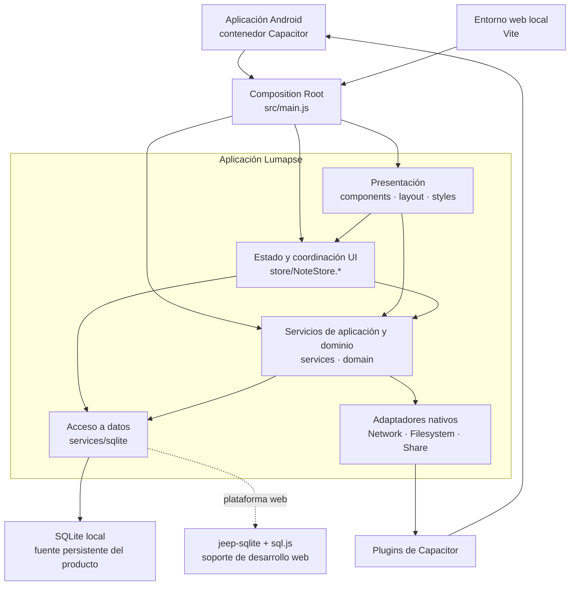
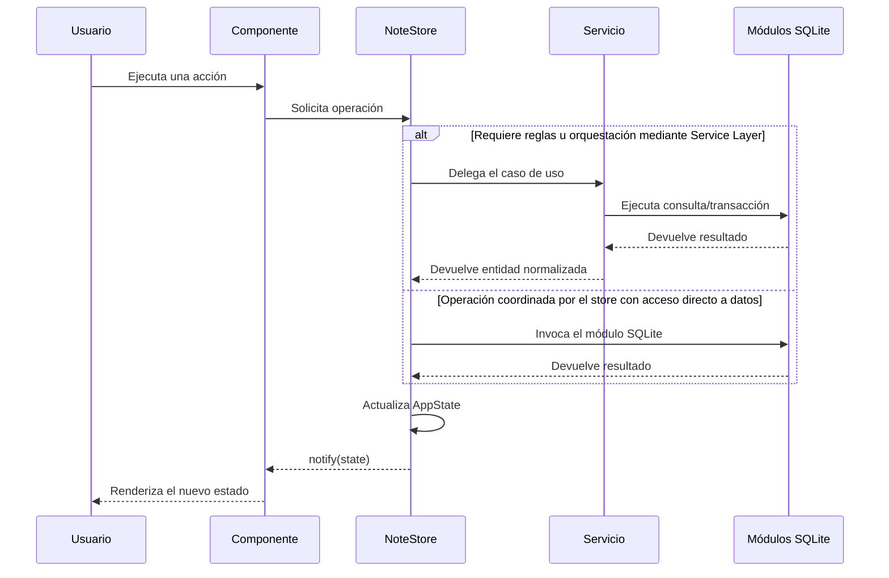

# Arquitectura de Componentes — Lumapse

**Estado:** `main` auditado el 2026-07-15; alcance funcional de la beta `v0.4.8`  
**Corte documental:** 2026-07-15  
**Decisión asociada:** [ADR-008 — Arquitectura modular y patrones](../adr/ADR-008-arquitectura-modular-y-patrones.md)

Lumapse se implementa como un **monolito modular cliente, offline-first**, construido con módulos ES y TypeScript gradual, empaquetado como aplicación Android mediante Capacitor. La separación es lógica: todos los módulos se entregan como una sola aplicación, pero cada capa tiene responsabilidades y dependencias delimitadas.

> **Frontera de versión:** La funcionalidad representada coincide con la APK `v0.4.8`. Los nombres de archivo y la evidencia de patrones se inspeccionaron sobre `main`, que contiene trabajo posterior al tag —incluidas migraciones JS→TS— no publicado como una nueva versión. El checkpoint anterior contabilizó 12 commits, pero ese número puede crecer. Una ruta `.ts` actual no implica que ese archivo con ese nombre haya formado parte de la APK.

## Responsabilidades y dirección de dependencias

| Capa | Ubicación principal | Responsabilidad | Puede depender de |
|---|---|---|---|
| Composición | `src/main.js` | Inicializar SQLite, construir la interfaz y conectar estado con vistas | Todas las capas necesarias para el arranque |
| Presentación | `src/components/`, `src/layout/`, `src/styles/` | Interacción, renderizado y navegación, agrupados por feature | Store, servicios y componentes compartidos |
| Estado | `src/store/` | Mantener estado observable y coordinar operaciones de la UI | Servicios, contratos de dominio y módulos SQLite de acceso a datos |
| Aplicación/dominio | `src/services/`, `src/domain/` | Validaciones, reglas, flujos y tipos compartidos | Acceso a datos y adaptadores de infraestructura |
| Persistencia | `src/services/sqlite/` | Conexión, esquema, migraciones, transacciones y CRUD de bajo nivel | SQLite/Capacitor; no depende de la UI |
| Integraciones | `src/services/backup/*Native*`, `BackupShareService.js` | Traducir APIs de Capacitor a conceptos del producto | Plugins nativos |

La regla principal es que la infraestructura no conoce a la presentación. Algunos componentes consumen servicios directamente y otros lo hacen a través del store. A su vez, el store usa dos recorridos válidos: delega en servicios cuando hay reglas u orquestación de dominio y accede directamente a módulos SQLite para operaciones de datos acotadas. Por eso la arquitectura es **por capas pragmática**, no una Clean Architecture estricta ni una cadena obligatoria UI → store → servicio → datos.

## Patrones observables en el código

| Patrón o enfoque | Clasificación | Evidencia | Aplicación real |
|---|---|---|---|
| **Composition Root** | Aplicado | [`src/main.js`](../../src/main.js) | Centraliza el arranque y el cableado de dependencias principales. |
| **Observer / Publish-Subscribe** | Aplicado | [`src/store/NoteStore.state.js`](../../src/store/NoteStore.state.js) | El store registra suscriptores, notifica cambios y devuelve una función de desuscripción. |
| **Service Layer** | Aplicado | [`src/services/AcademicEventService.ts`](../../src/services/AcademicEventService.ts), [`src/services/backup/BackupFlowService.ts`](../../src/services/backup/BackupFlowService.ts) | Encapsula reglas, validación y orquestación fuera de la UI y del SQL. |
| **Adapter** | Aplicado | [`src/services/backup/BackupNativeNetworkService.js`](../../src/services/backup/BackupNativeNetworkService.js), [`src/services/backup/BackupShareService.js`](../../src/services/backup/BackupShareService.js) | Traduce plugins nativos y fallbacks web a operaciones entendibles por la aplicación. |
| **Dependency Injection explícita** | Aplicada en servicios seleccionados | [`src/services/backup/BackupFlowService.ts`](../../src/services/backup/BackupFlowService.ts) | Recibe funciones reemplazables para red, creación, almacenamiento y compartición; facilita pruebas deterministas. |
| **Fachada modular / barrel** | Analogía parcial | [`src/store/NoteStore.js`](../../src/store/NoteStore.js), [`src/services/SubjectService.js`](../../src/services/SubjectService.js), [`src/services/ExportService.ts`](../../src/services/ExportService.ts) | Expone puntos de entrada estables sobre módulos especializados sin afirmar una fachada GoF completa. |
| **Data Access similar a Repository** | Analogía parcial | [`src/services/sqlite/`](../../src/services/sqlite/) | Aísla SQL y mapeo de filas sin definir repositorios intercambiables entre motores. |
| **Command Registry** | Inspirado en Command | [`src/components/note-editor/editorCommandRegistry.ts`](../../src/components/note-editor/editorCommandRegistry.ts) | Mantiene un catálogo declarativo de acciones, sin objetos uniformes `execute/undo`. |
| **Strategy/Policy funcional** | Enfoque funcional | [`src/store/noteFilters.ts`](../../src/store/noteFilters.ts), [`src/services/backup/BackupNetworkService.ts`](../../src/services/backup/BackupNetworkService.ts) | Selecciona reglas mediante funciones y discriminantes, no mediante una jerarquía de objetos Strategy. |
| **Component** | Enfoque de UI | [`src/components/`](../../src/components/) | Encapsula renderizado y eventos por feature sin imponer un ciclo de vida uniforme de framework. |

Los refactors hicieron visibles y verificables varios de estos límites, pero no originaron por sí solos los patrones: la clasificación surge de responsabilidades y dependencias observables.

## Flujos representativos

### Escritura y actualización visual

### Integración nativa

Los flujos de backup no llaman indiscriminadamente a APIs del dispositivo desde los componentes. Un servicio de aplicación coordina el caso de uso y los adaptadores traducen las APIs `Network`, `Filesystem` y `Share`. Esta frontera permite probar las reglas sin requerir un dispositivo físico.

## Alcance de la clasificación

- No es una arquitectura de microservicios: no existen servicios desplegables independientes ni comunicación remota entre procesos.
- No es MVC estricto: no hay controladores formales; componentes, store y servicios distribuyen esas responsabilidades.
- No es una PWA en su estado actual: Vite y el modo web sostienen desarrollo y pruebas, mientras Android + SQLite definen el canal funcional de la beta.
- La adopción de TypeScript es gradual y se concentra en contratos, dominio y servicios de mayor riesgo. Esto mejora seguridad estática sin convertir por sí solo el sistema en otra arquitectura.
