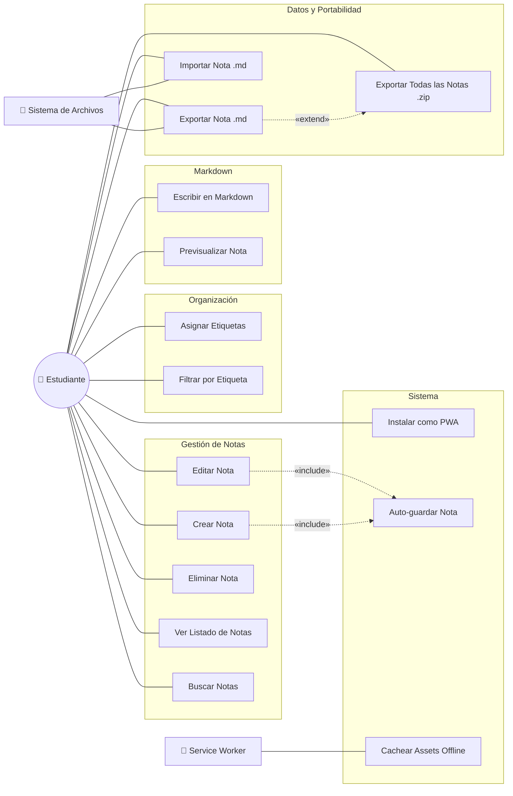

# Diagrama de Casos de Uso — Lumapse

**Tipo:** Diagrama UML de Comportamiento  
**Última actualización:** Abril 2026  
**Autor:** José David Sandoval

---

## Objetivo del diagrama

Representar las funcionalidades principales del sistema desde la perspectiva del usuario, identificando los **actores** que interactúan con la aplicación y los **casos de uso** que el sistema ofrece. Este diagrama es el punto de partida para entender **qué hace Lumapse**, no cómo lo hace internamente.

---

## Diagrama

---

## Descripción de Actores

| Actor | Tipo | Descripción |
|---|---|---|
| **Estudiante** | Principal | Usuario final de la aplicación. Representa a las personas [Lucía](../producto/personas.md#persona-1--lucía-la-estudiante-organizada) y [Martín](../producto/personas.md#persona-2--martín-el-estudiante-práctico). Interactúa directamente con todas las funcionalidades de la UI. |
| **Service Worker** | Sistema | Componente del navegador que gestiona el caché de assets y habilita el funcionamiento offline. Opera de forma transparente al usuario. |
| **Sistema de Archivos** | Sistema | Interfaz del SO que permite la lectura y escritura de archivos `.md` para las funcionalidades de exportación e importación. |

---

## Descripción de Casos de Uso

### Gestión de Notas (Core)

| ID | Caso de Uso | Descripción | RF asociado |
|---|---|---|---|
| UC-01 | Crear Nota | El estudiante crea una nueva nota con título y contenido vacío. | [RF-001](../producto/requisitos-funcionales.md) |
| UC-02 | Editar Nota | El estudiante modifica el título y/o contenido de una nota existente. | [RF-002](../producto/requisitos-funcionales.md) |
| UC-03 | Eliminar Nota | El estudiante elimina una nota con confirmación previa. | [RF-003](../producto/requisitos-funcionales.md) |
| UC-04 | Ver Listado de Notas | El sistema muestra todas las notas ordenadas por última modificación. | [RF-004](../producto/requisitos-funcionales.md) |
| UC-05 | Buscar Notas | El estudiante filtra notas por texto en título y contenido. | [RF-015](../producto/requisitos-funcionales.md) |

### Organización

| ID | Caso de Uso | Descripción | RF asociado |
|---|---|---|---|
| UC-06 | Asignar Etiquetas | El estudiante asigna hasta 5 etiquetas a una nota. | [RF-013](../producto/requisitos-funcionales.md) |
| UC-07 | Filtrar por Etiqueta | El estudiante filtra el listado seleccionando una etiqueta. | [RF-014](../producto/requisitos-funcionales.md) |

### Markdown

| ID | Caso de Uso | Descripción | RF asociado |
|---|---|---|---|
| UC-08 | Escribir en Markdown | El estudiante escribe contenido usando sintaxis Markdown. | [RF-010, RF-011](../producto/requisitos-funcionales.md) |
| UC-09 | Previsualizar Nota | El estudiante visualiza el Markdown renderizado en modo lectura. | [RF-012](../producto/requisitos-funcionales.md) |

### Datos y Portabilidad

| ID | Caso de Uso | Descripción | RF asociado |
|---|---|---|---|
| UC-10 | Exportar Nota .md | El estudiante descarga una nota como archivo `.md`. | [RF-016](../producto/requisitos-funcionales.md) |
| UC-11 | Importar Nota .md | El estudiante carga un archivo `.md` para crear una nota. | [RF-018](../producto/requisitos-funcionales.md) |
| UC-12 | Exportar Todas .zip | El estudiante descarga todas las notas como un `.zip`. | [RF-017](../producto/requisitos-funcionales.md) |

### Sistema (transparentes al usuario)

| ID | Caso de Uso | Descripción | RF asociado |
|---|---|---|---|
| UC-13 | Instalar como PWA | El estudiante instala la app en su dispositivo desde el navegador. | [RF-021](../producto/requisitos-funcionales.md) |
| UC-14 | Auto-guardar Nota | El sistema persiste automáticamente la nota activa tras 3s de inactividad. | [RF-005](../producto/requisitos-funcionales.md) |
| UC-15 | Cachear Assets Offline | El Service Worker almacena los recursos de la app para uso offline. | [RF-009](../producto/requisitos-funcionales.md) |

---

## Relaciones entre Casos de Uso

| Relación | Origen | Destino | Justificación |
|---|---|---|---|
| **«include»** | UC-01 (Crear Nota) | UC-14 (Auto-guardar) | Toda nota creada se persiste automáticamente. El auto-guardado es un comportamiento obligatorio que siempre ocurre. |
| **«include»** | UC-02 (Editar Nota) | UC-14 (Auto-guardar) | Toda edición dispara el auto-guardado. Es un flujo obligatorio, no opcional. |
| **«extend»** | UC-10 (Exportar Nota) | UC-12 (Exportar Todas) | Exportar todas las notas es una extensión opcional del caso base de exportar una nota individual. Solo se activa si el usuario elige la opción de exportación masiva. |

### ¿Por qué `«include»` y no `«extend»` para el auto-guardado?

- **`«include»`** indica que el caso de uso incluido se ejecuta **siempre** como parte del flujo del caso de uso base. El auto-guardado no es opcional: cada vez que se crea o edita una nota, el sistema la persiste.
- **`«extend»`** indicaría que el comportamiento solo se ejecuta bajo ciertas condiciones. Esto no aplica al auto-guardado, que es determinista.

---

## Trazabilidad: Casos de Uso → Hitos

| Hito | Casos de Uso |
|---|---|
| **02** (Junio) | UC-01 a UC-04, UC-14 |
| **03** (Julio) | UC-08 a UC-13, UC-15 |
| **04** (Agosto) | UC-05 a UC-07 |

---

*Documento de la fase Idear · Análisis y Relevamiento · Lumapse · PP3 · 2026*
