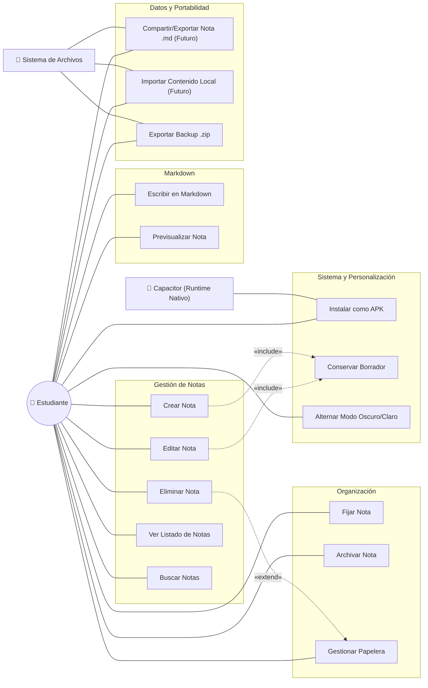

# Diagrama de Casos de Uso — Lumapse

**Tipo:** Diagrama UML de Comportamiento  
**Última actualización:** 2026-06-07
**Autor:** José David Sandoval

---

## Objetivo del diagrama

Representar las funcionalidades principales del sistema desde la perspectiva del usuario, identificando los **actores** que interactúan con la aplicación y los **casos de uso** que el sistema ofrece. Este diagrama es el punto de partida para entender **qué hace Lumapse**, no cómo lo hace internamente.

> **Nota de evolución:** Desde el pivote a app nativa ([ADR-005](../adr/ADR-005-pivote-app-nativa.md)), se eliminaron los casos de uso relacionados con PWA y Service Worker (UC-13 y UC-15 del modelo anterior). Se incorporaron los casos de uso de organización (Pin/Archivar), personalización visual (tema oscuro/claro), backup manual y borradores persistentes del editor. UC-10 y UC-11 pasan a deuda posterior.

---

## Diagrama

---

## Descripción de Actores

| Actor | Tipo | Descripción |
|---|---|---|
| **Estudiante** | Principal | Usuario final de la aplicación. Representa a las personas [Lucía](../producto/personas.md#persona-1--lucía-la-estudiante-organizada) y [Martín](../producto/personas.md#persona-2--martín-el-estudiante-práctico). Interactúa directamente con todas las funcionalidades de la UI. |
| **Capacitor (Runtime Nativo)** | Sistema | Framework que empaqueta la web app como APK nativo para Android. Gestiona el ciclo de vida de la app, el acceso a APIs nativas y la distribución del binario en el dispositivo ([ADR-005](../adr/ADR-005-pivote-app-nativa.md)). |
| **Sistema de Archivos** | Sistema | Interfaz del SO que permitiría leer/escribir archivos locales para portabilidad. Su integración visible queda pendiente de decisión en Hito 05. |

---

## Descripción de Casos de Uso

### Gestión de Notas (Core)

| ID | Caso de Uso | Descripción | RF asociado |
|---|---|---|---|
| UC-01 | Crear Nota | El estudiante redacta una nueva nota y confirma su creación con `Guardar`. El título se extrae automáticamente de la primera línea `# ` del Markdown si no se escribe uno explícito. | [RF-001](../producto/requisitos-funcionales.md) |
| UC-02 | Editar Nota | El estudiante modifica el contenido de una nota existente y confirma los cambios con `Actualizar`. | [RF-002](../producto/requisitos-funcionales.md) |
| UC-03 | Eliminar Nota | El estudiante elimina una nota con confirmación previa desde el menú contextual. | [RF-003](../producto/requisitos-funcionales.md) |
| UC-04 | Ver Listado de Notas | El sistema muestra todas las notas en un feed tipo microblog, ordenadas por última modificación. Las notas fijadas aparecen al tope. | [RF-004](../producto/requisitos-funcionales.md) |
| UC-05 | Buscar Notas | El estudiante filtra notas por texto en título y contenido desde el campo de búsqueda en el drawer. | [RF-015](../producto/requisitos-funcionales.md) |

### Organización

| ID | Caso de Uso | Descripción | RF asociado |
|---|---|---|---|
| UC-06 | Fijar Nota | El estudiante fija una nota para que aparezca siempre al tope del feed, con un indicador visual (ícono pin). La acción es reversible (desfijar). | [RF-013](../producto/requisitos-funcionales.md) |
| UC-07 | Archivar Nota | El estudiante archiva una nota para ocultarla del feed principal. Las notas archivadas son accesibles desde la vista "Ver archivadas" en el drawer. La acción es reversible (desarchivar). | [RF-013](../producto/requisitos-funcionales.md) |
| UC-16 | Gestionar Papelera | El estudiante accede a la papelera de reciclaje desde el drawer para ver las notas y materias eliminadas. Puede restaurar elementos individualmente o vaciar la papelera completa (eliminación permanente). Las notas eliminadas se mueven a la papelera (soft-delete) en lugar de borrarse físicamente. | [RF-026](../producto/requisitos-funcionales.md) |

### Markdown

| ID | Caso de Uso | Descripción | RF asociado |
|---|---|---|---|
| UC-08 | Escribir en Markdown | El estudiante escribe contenido usando sintaxis Markdown. | [RF-010, RF-011](../producto/requisitos-funcionales.md) |
| UC-09 | Previsualizar Nota | El estudiante visualiza el Markdown renderizado en modo lectura o en vista dividida (split). | [RF-012](../producto/requisitos-funcionales.md) |

### Datos y Portabilidad

| ID | Caso de Uso | Descripción | RF asociado |
|---|---|---|---|
| UC-10 | Compartir/Exportar Nota .md | El estudiante comparte o guarda una nota como Markdown. Deuda posterior; requiere share sheet nativo de Android validado. | [RF-016](../producto/requisitos-funcionales.md) |
| UC-11 | Importar Contenido Local | El estudiante incorpora archivos locales sin sobrescribir notas existentes. Deuda posterior; una nota individual importada debe entrar en `Entrada`. | [RF-018](../producto/requisitos-funcionales.md) |
| UC-12 | Exportar Backup .zip | El estudiante genera un respaldo local `.zip` del workspace, legible/restaurable y con salida externa por share sheet o gestor de archivos. | [RF-017](../producto/requisitos-funcionales.md) |

### Sistema y Personalización

| ID | Caso de Uso | Descripción | RF asociado |
|---|---|---|---|
| UC-13 | Instalar como APK | El estudiante instala la aplicación en su dispositivo Android como APK nativo, empaquetado mediante Capacitor. | [RF-020](../producto/requisitos-funcionales.md) |
| UC-14 | Conservar Borrador | El sistema conserva localmente el borrador del editor mientras el usuario crea o edita, lo restaura al volver y lo limpia al guardar, actualizar o descartar. | [RF-005](../producto/requisitos-funcionales.md) |
| UC-15 | Alternar Modo Oscuro/Claro | El estudiante alterna entre modo oscuro y claro desde el drawer. La preferencia se persiste en `localStorage` y, si no existe, se respeta la configuración del OS. | [RF-019](../producto/requisitos-funcionales.md) |

---

## Relaciones entre Casos de Uso

| Relación | Origen | Destino | Justificación |
|---|---|---|---|
| **«include»** | UC-01 (Crear Nota) | UC-14 (Conservar Borrador) | Mientras se redacta una nota nueva, el sistema protege el trabajo en curso sin crear la nota final hasta que el usuario confirma con `Guardar`. |
| **«include»** | UC-02 (Editar Nota) | UC-14 (Conservar Borrador) | Mientras se edita una nota existente, el sistema protege los cambios pendientes sin actualizar la nota final hasta que el usuario confirma con `Actualizar`. |
| **«extend»** | UC-03 (Eliminar Nota) | UC-16 (Gestionar Papelera) | La eliminación de una nota envía el elemento a la papelera (soft-delete). El usuario puede gestionar la papelera opcionalmente después. |

### ¿Por qué `«include»` y no `«extend»` para conservar borrador?

- **`«include»`** indica que la protección del borrador se ejecuta como parte normal de crear o editar. No cambia la intención final del usuario, pero evita pérdida de texto si sale de la app, cambia de vista o consulta otro material.
- **`«extend»`** indicaría un comportamiento opcional o excepcional. Esto no aplica a la protección del trabajo en curso, que debe estar disponible de forma permanente.

---

## Trazabilidad: Casos de Uso → Hitos

| Hito | Casos de Uso |
|---|---|
| **02** (Junio) | UC-01 a UC-04 |
| **03** (Julio) | UC-08, UC-09 |
| **04** (Agosto) | UC-05, UC-06, UC-07, UC-13, UC-15, UC-16 |
| **05** (Septiembre) | UC-12, UC-14 |
| **Futuro / Post-release** | UC-10, UC-11 |

---

*Documento de la fase Idear · Análisis y Relevamiento · Lumapse · PP3 · 2026*
