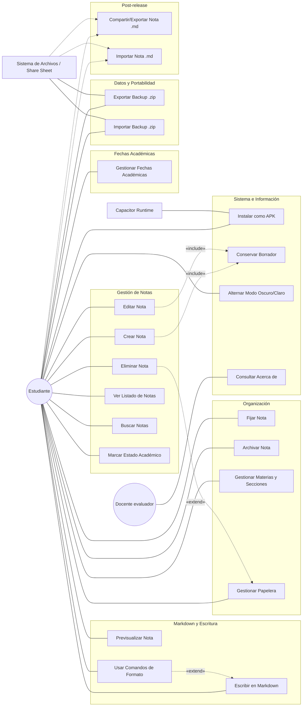

# Diagrama de Casos de Uso — Lumapse

**Tipo:** Diagrama UML de Comportamiento  
**Última actualización:** 2026-07-15 
**Autor:** José David Sandoval

---

## Objetivo del diagrama

Representar las funcionalidades principales del sistema desde la perspectiva del usuario, identificando los **actores** que interactúan con la aplicación y los **casos de uso** que Lumapse ofrece en el corte `v0.4.8`. Este diagrama muestra **qué hace el producto**, separando el alcance implementado de las funcionalidades post-release.

> **Nota de evolución:** Desde el pivote a aplicación Android híbrida ([ADR-005](../adr/ADR-005-pivote-app-nativa.md)), se eliminaron los casos de uso relacionados con PWA y Service Worker. En Hito 05 se incorporan borradores persistentes (`RF-005`), backup manual `.zip` (`RF-017`), importación de backups ZIP (`RF-018`), sección Acerca de (`RF-023`), fechas académicas discretas (`RF-027`) y editor enriquecido (`RF-028`). Compartir/exportar una nota individual e importar una nota `.md` quedan explícitamente como post-release.

> **Frontera de versión:** Este documento afirma capacidades de la APK `v0.4.8`; sus enlaces apuntan a la documentación vigente en `main` y no convierten los cambios posteriores al tag en una release nueva.

---

## Diagrama

---

## Descripción de Actores

| Actor | Tipo | Descripción |
|---|---|---|
| **Estudiante** | Principal | Usuario final de la aplicación. Representa a las personas [Lucía](../producto/personas.md#persona-1--lucía-la-estudiante-organizada) y [Martín](../producto/personas.md#persona-2--martín-el-estudiante-práctico). Interactúa directamente con las funcionalidades de captura, organización, búsqueda, backup y consulta académica. |
| **Docente evaluador** | Principal secundario | Actor académico que consulta información institucional y técnica mínima desde la sección Acerca de, sin depender de documentación externa. |
| **Capacitor Runtime** | Sistema | Framework que ejecuta la UI web en una WebView, genera el paquete Android y expone plugins nativos para distribuir Lumapse como aplicación instalable ([ADR-005](../adr/ADR-005-pivote-app-nativa.md)). |
| **Sistema de Archivos / Share Sheet** | Sistema | Interfaz del sistema operativo usada por la portabilidad local: exportar backups `.zip`, importar backups generados por Lumapse y, en el futuro, compartir/importar notas individuales. |

---

## Descripción de Casos de Uso

### Gestión de Notas (Core)

| ID | Caso de Uso | Descripción | RF asociado |
|---|---|---|---|
| UC-01 | Crear Nota | El estudiante redacta una nueva nota y confirma su creación con `Guardar`. El título se extrae automáticamente de la primera línea `# ` del Markdown si no se escribe uno explícito. | [RF-001](../producto/requisitos-funcionales.md) |
| UC-02 | Editar Nota | El estudiante modifica el contenido de una nota existente y confirma los cambios con `Actualizar`. | [RF-002](../producto/requisitos-funcionales.md) |
| UC-03 | Eliminar Nota | El estudiante elimina una nota con confirmación previa desde el menú contextual. La eliminación es lógica y envía la nota a la papelera. | [RF-003](../producto/requisitos-funcionales.md), [RF-026](../producto/requisitos-funcionales.md) |
| UC-04 | Ver Listado de Notas | El sistema muestra todas las notas activas en un feed tipo microblog, ordenadas por última modificación. Las notas fijadas aparecen al tope. | [RF-004](../producto/requisitos-funcionales.md) |
| UC-05 | Buscar Notas | El estudiante filtra notas activas por texto en título y contenido. La búsqueda es global y tolerante a mayúsculas/minúsculas y tildes. | [RF-015](../producto/requisitos-funcionales.md) |
| UC-18 | Marcar Estado Académico | El estudiante asigna a una nota un marcador visual curado de estado académico (`📖`, `❓`, `🔥`, `✅`). | [RF-025](../producto/requisitos-funcionales.md) |

### Organización

| ID | Caso de Uso | Descripción | RF asociado |
|---|---|---|---|
| UC-06 | Fijar Nota | El estudiante fija una nota para que aparezca siempre al tope del feed. La acción es reversible. | [RF-013](../producto/requisitos-funcionales.md) |
| UC-07 | Archivar Nota | El estudiante archiva una nota para ocultarla del feed principal. Las notas archivadas quedan accesibles desde el drawer. | [RF-013](../producto/requisitos-funcionales.md) |
| UC-17 | Gestionar Materias y Secciones | El estudiante crea, renombra, elimina, archiva o selecciona materias y secciones de hasta dos niveles para clasificar sus notas. | [RF-014](../producto/requisitos-funcionales.md) |
| UC-16 | Gestionar Papelera | El estudiante accede a la papelera de reciclaje para ver notas y materias eliminadas, restaurar elementos o vaciarla permanentemente. | [RF-026](../producto/requisitos-funcionales.md) |

### Markdown y Escritura

| ID | Caso de Uso | Descripción | RF asociado |
|---|---|---|---|
| UC-08 | Escribir en Markdown | El estudiante escribe contenido en texto plano o Markdown portable. | [RF-010](../producto/requisitos-funcionales.md), [RF-011](../producto/requisitos-funcionales.md) |
| UC-09 | Previsualizar Nota | El estudiante visualiza el Markdown renderizado en modo lectura o en vista dividida. | [RF-012](../producto/requisitos-funcionales.md) |
| UC-19 | Usar Comandos de Formato | El estudiante usa comandos `/`, botón `+`, botón `Aa`, callouts y continuidad inteligente para enriquecer la nota sin formato propietario. | [RF-028](../producto/requisitos-funcionales.md) |

### Fechas Académicas

| ID | Caso de Uso | Descripción | RF asociado |
|---|---|---|---|
| UC-21 | Gestionar Fechas Académicas | El estudiante registra parciales, finales, trabajos prácticos o exposiciones como recordatorios visuales discretos integrados al Heatmap y a la lista de próximas fechas. | [RF-027](../producto/requisitos-funcionales.md) |

### Datos y Portabilidad

| ID | Caso de Uso | Descripción | RF asociado |
|---|---|---|---|
| UC-12 | Exportar Backup .zip | El estudiante genera un respaldo local `.zip` del workspace, con manifiesto, datos estructurados, notas Markdown legibles y salida externa por share sheet o gestor de archivos. | [RF-017](../producto/requisitos-funcionales.md) |
| UC-20 | Importar Backup .zip | El estudiante selecciona un backup ZIP generado por Lumapse, revisa una vista previa e importa notas, materias, secciones y fechas académicas de forma no destructiva y transaccional. | [RF-018](../producto/requisitos-funcionales.md) |
| UC-10 | Compartir/Exportar Nota .md | Post-release. El estudiante comparte o guarda una nota individual como Markdown usando share sheet nativo validado. | [RF-016](../producto/requisitos-funcionales.md) |
| UC-11 | Importar Nota .md | Post-release. El estudiante importa una nota individual hacia `Entrada`, sin recrear materias o secciones de origen. | — Sin RF formal vigente |

### Sistema e Información

| ID | Caso de Uso | Descripción | RF asociado |
|---|---|---|---|
| UC-13 | Instalar como APK | El estudiante instala Lumapse como APK Android híbrida empaquetada mediante Capacitor. | Sin RF funcional independiente; decisión de canal en [ADR-005](../adr/ADR-005-pivote-app-nativa.md) |
| UC-14 | Conservar Borrador | El sistema conserva localmente el borrador del editor mientras el usuario crea o edita, lo restaura al volver y lo limpia al guardar, actualizar o descartar. | [RF-005](../producto/requisitos-funcionales.md) |
| UC-15 | Alternar Modo Oscuro/Claro | El estudiante alterna entre modo oscuro y claro desde el drawer. La preferencia se persiste localmente y puede respetar la configuración del sistema operativo. | [RF-019](../producto/requisitos-funcionales.md) |
| UC-22 | Consultar Acerca de | El docente evaluador o estudiante consulta versión, autor, licencia, propósito y alcance offline/local de la app. | [RF-023](../producto/requisitos-funcionales.md) |

---

## Relaciones entre Casos de Uso

| Relación | Origen | Destino | Justificación |
|---|---|---|---|
| **«include»** | UC-01 (Crear Nota) | UC-14 (Conservar Borrador) | Mientras se redacta una nota nueva, el sistema protege el trabajo en curso sin crear la nota final hasta que el usuario confirma con `Guardar`. |
| **«include»** | UC-02 (Editar Nota) | UC-14 (Conservar Borrador) | Mientras se edita una nota existente, el sistema protege los cambios pendientes sin actualizar la nota final hasta que el usuario confirma con `Actualizar`. |
| **«extend»** | UC-19 (Usar Comandos de Formato) | UC-08 (Escribir en Markdown) | Los comandos enriquecen la escritura, pero no son obligatorios para usar Lumapse: escribir texto plano sigue siendo el flujo base. |
| **«extend»** | UC-03 (Eliminar Nota) | UC-16 (Gestionar Papelera) | La eliminación envía el elemento a la papelera; la gestión posterior de esa papelera es un flujo opcional. |

### ¿Por qué `«include»` y no `«extend»` para conservar borrador?

- **`«include»`** indica que la protección del borrador se ejecuta como parte normal de crear o editar. No cambia la intención final del usuario, pero evita pérdida de texto si sale de la app, cambia de vista o consulta otro material.
- **`«extend»`** indicaría un comportamiento opcional o excepcional. Esto no aplica a la protección del trabajo en curso, que debe estar disponible de forma permanente.

---

## Trazabilidad: Casos de Uso → Hitos

| Hito | Casos de Uso |
|---|---|
| **02** (Junio) | UC-01, UC-02, UC-03, UC-04 |
| **03** (Julio) | UC-08, UC-09 |
| **04** (Agosto) | UC-05, UC-06, UC-07, UC-13, UC-15, UC-16, UC-17, UC-18 |
| **05** (Septiembre) | UC-12, UC-14, UC-19, UC-20, UC-21, UC-22 |
| **Futuro / Post-release** | UC-10, UC-11 |

---

*Documento de la fase Idear · Análisis y Relevamiento · Lumapse · PP3 · 2026*
