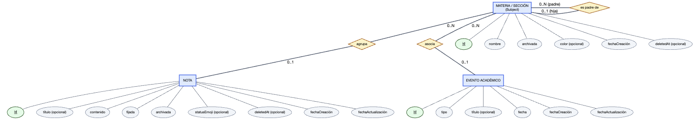
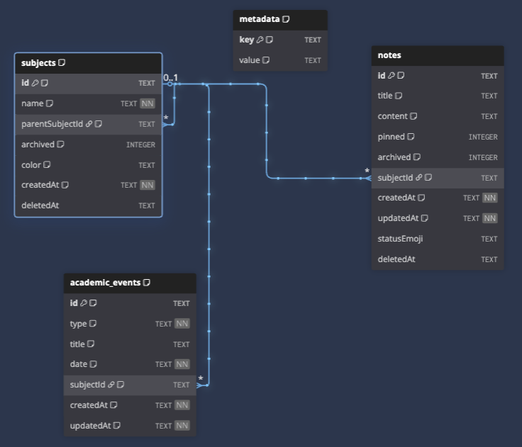

# Diagramas de Base de Datos — Lumapse

Esta carpeta documenta el diseño de datos en tres niveles de abstracción. Las **fuentes editables** se versionan en el repositorio y las **imágenes son artefactos derivados** que deben exportarse con herramientas externas.

- **Autor:** José David Sandoval
- **Motor:** SQLite mediante `@capacitor-community/sqlite`
- **Versión de referencia:** `0.4.8`
- **Auditoría documental:** 2026-07-15

## Contenido y autoridad

| Archivo | Nivel | Rol | Estado al corte |
|---|---|---|---|
| [`01-modelo-conceptual-der-chen.dot`](./01-modelo-conceptual-der-chen.dot) | Conceptual | Fuente Graphviz | Sincronizada con `v0.4.8`; fuente de la exportación vigente |
| [`01-modelo-conceptual-der-chen.png`](./01-modelo-conceptual-der-chen.png) | Conceptual | Imagen derivada | Reemplazada y revisada el 2026-07-15 |
| [`02-normalizacion.md`](./02-normalizacion.md) | Lógico | Justificación de 1FN, 2FN y 3FN | Referencia textual vigente |
| [`03-modelo-logico-relacional.dbml`](./03-modelo-logico-relacional.dbml) | Lógico | Fuente DBML | Sincronizada con el esquema ejecutable; fuente de la exportación vigente |
| [`03-modelo-logico-relacional.png`](./03-modelo-logico-relacional.png) | Lógico | Imagen derivada | Reemplazada y revisada el 2026-07-15 |
| [`04-modelo-fisico-ddl.md`](./04-modelo-fisico-ddl.md) | Físico | Documentación del DDL y migraciones | Referencia técnica vigente |
| [`src/services/sqlite/connection.js`](../../../src/services/sqlite/connection.js) | Físico ejecutable | Fuente de verdad del esquema en runtime | Autoridad final si existe una divergencia |

La tabla `metadata` aparece en el DBML y en el modelo físico porque forma parte del esquema ejecutable. Se excluye deliberadamente del DER conceptual: es una tabla técnica clave-valor utilizada para migraciones y flags internos, no una entidad del dominio académico.

## Diferencias resueltas en las fuentes

La revisión del 2026-07-15 sincronizó las fuentes editables con el schema de `v0.4.8`. El diff técnico entre el tag y el checkpoint previo a esta revisión confirmó que los cambios posteriores no modificaron `connection.js`:

- el DER conceptual ya incluye `EVENTO ACADÉMICO` y su asociación opcional con `MATERIA / SECCIÓN`;
- `MATERIA` y `SECCIÓN` se representan como una única entidad `Subject` autorreferenciada;
- `NOTA` incorpora los atributos vigentes relevantes, incluidos `statusEmoji` y `deletedAt`, y `Subject` incorpora su borrado lógico mediante `deletedAt`;
- las asociaciones opcionales de `NOTA` y `EVENTO ACADÉMICO` con `Subject` expresan los casos Entrada/sin materia, con cardinalidades `0..1` del lado de cada registro y `0..N` del lado de `Subject`;
- las claves foráneas y acciones `ON DELETE` permanecen detalladas en el DBML, sin duplicarlas como atributos en el modelo conceptual;
- `metadata` queda documentada como tabla técnica: incluida en los niveles lógico y físico, excluida del conceptual;
- la nota de `notes.title` aclara que el título explícito es opcional, el H1 inicial es solo fallback y `Sin título` es el valor final cuando ambos faltan.

## Exportaciones verificadas

Las fuentes DOT y DBML sincronizadas se exportaron con las herramientas externas previstas y sus PNG se reemplazaron el 2026-07-15. La revisión visual confirmó que las imágenes representan el mismo alcance que sus fuentes y que el modelo implementado.

### Modelo conceptual



**Figura DB-1.** Modelo conceptual de Lumapse, exportado desde [`01-modelo-conceptual-der-chen.dot`](./01-modelo-conceptual-der-chen.dot) mediante Graphviz/edotor.net. Representa `Subject` —Materia o Sección—, `Note` y `AcademicEvent`, con sus relaciones y cardinalidades. La tabla técnica `metadata` no aparece porque no es una entidad del dominio académico.

La exportación es panorámica (`1622 × 296 px`). Su contenido fue verificado, pero la legibilidad al tamaño definitivo deberá confirmarse al componer el PDF y las diapositivas; si el texto queda pequeño, corresponde reexportar o disponer la figura en orientación horizontal, sin alterar el modelo.

### Modelo lógico relacional



**Figura DB-2.** Modelo lógico relacional de Lumapse, exportado desde [`03-modelo-logico-relacional.dbml`](./03-modelo-logico-relacional.dbml) mediante dbdiagram.io. Incluye las cuatro tablas del esquema (`subjects`, `notes`, `academic_events` y `metadata`), sus 26 columnas y las tres relaciones declaradas.

Los PNG son artefactos derivados: no se corrigen manualmente. Cualquier cambio futuro debe aplicarse primero a las fuentes y al esquema ejecutable, ejecutar los verificadores y luego producir una nueva exportación.

## Flujo metodológico

```text
Modelo conceptual (DOT → Graphviz/edotor.net)
        ↓
Normalización (1FN → 2FN → 3FN)
        ↓
Modelo lógico (DBML → dbdiagram.io)
        ↓
Modelo físico (DDL y migraciones en connection.js)
```

La coherencia entre DBML, DDL documentado y esquema ejecutable se valida con las herramientas del repositorio antes de exportar las imágenes. Para este corte, `npm run check:dbml` y `npm run check:schema` finalizaron correctamente.

## Procedimiento de actualización externa

### DER conceptual

1. Abrir la fuente vigente [`01-modelo-conceptual-der-chen.dot`](./01-modelo-conceptual-der-chen.dot) en [edotor.net](https://edotor.net) o Graphviz.
2. Renderizar sin modificar el contenido conceptual validado.
3. Exportar en una resolución legible y reemplazar `01-modelo-conceptual-der-chen.png`.
4. Verificar visualmente entidades, atributos, relaciones y cardinalidades.

### Modelo lógico

1. Ejecutar `python3 scripts/generate-dbml-from-code.py --check` sobre [`03-modelo-logico-relacional.dbml`](./03-modelo-logico-relacional.dbml).
2. Importar el DBML validado en [dbdiagram.io](https://dbdiagram.io).
3. Exportar y reemplazar `03-modelo-logico-relacional.png`.
4. Verificar que ninguna tabla, FK o restricción relevante haya quedado fuera del encuadre.

## Criterios de cierre

- Las fuentes editables coinciden con `connection.js` y con la documentación física.
- Los verificadores de esquema del repositorio finalizan correctamente.
- Ambos PNG tienen fecha de exportación posterior al último cambio de sus fuentes.
- Las imágenes representan visualmente el alcance de las fuentes; la legibilidad al tamaño final de informe y diapositivas se valida durante la maquetación.
- El informe cita la versión `0.4.8` o el corte posterior que finalmente se presente.
