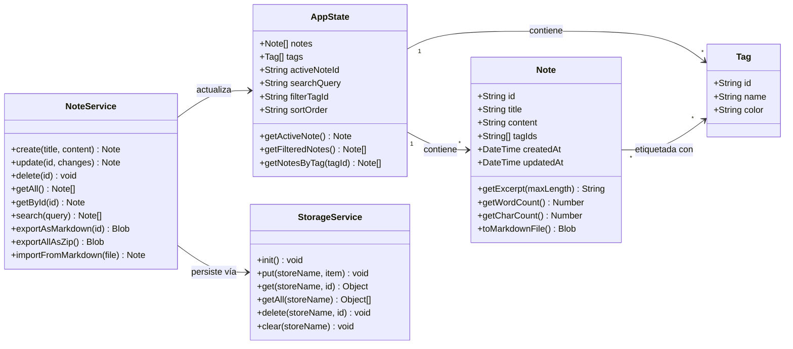

# Modelo de Dominio — Lumapse

**Tipo:** Diagrama UML de Estructura (Clases)  
**Última actualización:** Abril 2026  
**Autor:** José David Sandoval

---

## Objetivo del diagrama

Modelar las **entidades principales** del dominio de Lumapse y sus relaciones. Este diagrama representa la estructura conceptual de los datos que el sistema maneja, independientemente de cómo se implementan internamente. Es el punto de partida para el diseño de la capa de persistencia (IndexedDB) y del estado de la aplicación (Store).

---

## Diagrama de Clases



---

## Descripción de Entidades

### Note (Nota)

Entidad principal del dominio. Representa una unidad de contenido creada por el usuario.

| Atributo | Tipo | Descripción |
|---|---|---|
| `id` | `String` | Identificador único (UUID v4 generado con `crypto.randomUUID()`). |
| `title` | `String` | Título de la nota. Valor por defecto: `"Sin título"`. Máximo 200 caracteres. |
| `content` | `String` | Contenido de la nota en formato Markdown (texto plano). Sin límite de tamaño. |
| `tagIds` | `String[]` | Lista de IDs de etiquetas asociadas. Máximo 5 por nota ([RF-013](../producto/requisitos-funcionales.md)). |
| `createdAt` | `DateTime` | Fecha y hora de creación (ISO 8601). Inmutable. |
| `updatedAt` | `DateTime` | Fecha y hora de última modificación. Se actualiza en cada guardado. |

| Método | Retorno | Descripción |
|---|---|---|
| `getExcerpt(maxLength)` | `String` | Primeros `n` caracteres del contenido, para mostrar en el listado. |
| `getWordCount()` | `Number` | Conteo de palabras del contenido ([RF-006](../producto/requisitos-funcionales.md)). |
| `getCharCount()` | `Number` | Conteo de caracteres del contenido. |
| `toMarkdownFile()` | `Blob` | Genera un archivo `.md` descargable con el contenido de la nota. |

---

### Tag (Etiqueta)

Entidad de clasificación. Permite al usuario organizar notas por categoría.

| Atributo | Tipo | Descripción |
|---|---|---|
| `id` | `String` | Identificador único (UUID v4). |
| `name` | `String` | Nombre de la etiqueta (ej: "Matemáticas", "Programación"). Único. Máximo 30 caracteres. |
| `color` | `String` | Color en formato hex (ej: `#a3e635`). Para diferenciación visual en la UI. |

---

### AppState (Estado de la Aplicación)

Objeto centralizado que mantiene el estado en memoria de la aplicación. No se persiste directamente — se reconstruye a partir de los datos en IndexedDB al iniciar la app.

| Atributo | Tipo | Descripción |
|---|---|---|
| `notes` | `Note[]` | Todas las notas cargadas desde IndexedDB. |
| `tags` | `Tag[]` | Todas las etiquetas disponibles. |
| `activeNoteId` | `String \| null` | ID de la nota actualmente abierta en el editor. |
| `searchQuery` | `String` | Texto de búsqueda activo. Vacío = sin filtro. |
| `filterTagId` | `String \| null` | ID de la etiqueta de filtro activa. `null` = sin filtro. |
| `sortOrder` | `String` | Orden del listado: `"updatedAt:desc"` (default), `"title:asc"`. |

| Método | Retorno | Descripción |
|---|---|---|
| `getActiveNote()` | `Note` | Retorna la nota que corresponde a `activeNoteId`. |
| `getFilteredNotes()` | `Note[]` | Retorna las notas filtradas por `searchQuery` y `filterTagId`, ordenadas por `sortOrder`. |
| `getNotesByTag(tagId)` | `Note[]` | Retorna todas las notas que contienen el tag indicado. |

---

### NoteService (Servicio de Notas)

Capa de lógica de negocio. Coordina las operaciones sobre notas entre el estado en memoria y la persistencia.

| Método | Retorno | Descripción |
|---|---|---|
| `create(title, content)` | `Note` | Crea una nueva nota, la persiste y la agrega al estado. |
| `update(id, changes)` | `Note` | Actualiza una nota existente, persiste los cambios y actualiza `updatedAt`. |
| `delete(id)` | `void` | Elimina una nota de IndexedDB y del estado. |
| `getAll()` | `Note[]` | Recupera todas las notas desde IndexedDB. |
| `getById(id)` | `Note` | Recupera una nota específica por ID. |
| `search(query)` | `Note[]` | Búsqueda por texto en título y contenido. |
| `exportAsMarkdown(id)` | `Blob` | Genera un archivo `.md` para descarga. |
| `exportAllAsZip()` | `Blob` | Genera un `.zip` con todas las notas como archivos `.md`. |
| `importFromMarkdown(file)` | `Note` | Crea una nota a partir de un archivo `.md` importado. |

---

### StorageService (Servicio de Almacenamiento)

Abstracción sobre IndexedDB. Encapsula todas las operaciones de lectura/escritura al storage del navegador.

| Método | Retorno | Descripción |
|---|---|---|
| `init()` | `void` | Inicializa la base de datos IndexedDB y crea los object stores necesarios. |
| `put(storeName, item)` | `void` | Inserta o actualiza un registro en el store indicado. |
| `get(storeName, id)` | `Object` | Recupera un registro por ID. |
| `getAll(storeName)` | `Object[]` | Recupera todos los registros del store. |
| `delete(storeName, id)` | `void` | Elimina un registro por ID. |
| `clear(storeName)` | `void` | Elimina todos los registros del store. |

> Esta capa utiliza la librería [`idb`](https://github.com/niceferrari/idb) como wrapper liviano sobre la API nativa de IndexedDB, según lo documentado en [ADR-002](../adr/ADR-002-persistencia-indexeddb.md).

---

## Relaciones

| Relación | Cardinalidad | Descripción |
|---|---|---|
| AppState → Note | 1 a muchos | El estado contiene todas las notas de la app. |
| AppState → Tag | 1 a muchos | El estado contiene todas las etiquetas disponibles. |
| Note → Tag | Muchos a muchos | Una nota puede tener hasta 5 etiquetas; una etiqueta puede estar en múltiples notas. |
| NoteService → StorageService | Dependencia | NoteService delega la persistencia al StorageService. |
| NoteService → AppState | Dependencia | NoteService actualiza el estado en memoria después de cada operación. |

---

## Esquema de IndexedDB

```
Database: "lumapse-db"
├── Object Store: "notes"
│   ├── keyPath: "id"
│   ├── index: "updatedAt" (para ordenamiento)
│   └── Registros: { id, title, content, tagIds, createdAt, updatedAt }
│
└── Object Store: "tags"
    ├── keyPath: "id"
    ├── index: "name" (unique, para búsqueda)
    └── Registros: { id, name, color }
```

---

*Documento de la fase Idear · Análisis y Relevamiento · Lumapse · PP3 · 2026*
