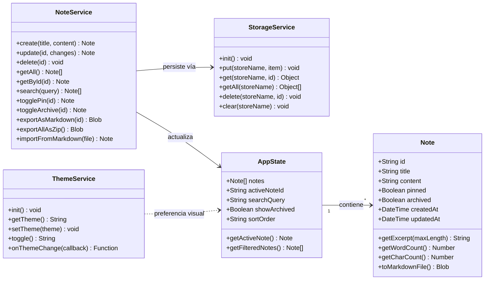

# Modelo de Dominio — Lumapse

**Tipo:** Diagrama UML de Estructura (Clases)  
**Última actualización:** Mayo 2026  
**Autor:** José David Sandoval

---

## Objetivo del diagrama

Modelar las **entidades principales** del dominio de Lumapse y sus relaciones. Este diagrama representa la estructura conceptual de los datos que el sistema maneja, independientemente de cómo se implementan internamente. Es el punto de partida para el diseño de la capa de persistencia (IndexedDB, con migración planificada a SQLite) y del estado de la aplicación (Store).

> **Nota de evolución:** En versiones anteriores (Hito 00), el modelo incluía una entidad `Tag` para clasificar notas con etiquetas. Esta entidad fue descartada a favor de una organización por carpetas/materias ([DP-002](../producto/decisiones-producto.md)), que aún no ha sido implementada. El modelo actual refleja el código en producción.

---

## Diagrama de Clases



---

## Descripción de Entidades

### Note (Nota)

Entidad principal del dominio. Representa una unidad de contenido creada por el usuario.

| Atributo | Tipo | Descripción |
|---|---|---|
| `id` | `String` | Identificador único (UUID v4 generado con `crypto.randomUUID()`). |
| `title` | `String` | Título de la nota. Se extrae automáticamente de la primera línea `# ` del contenido Markdown ([DP-001](../producto/decisiones-producto.md)). |
| `content` | `String` | Contenido de la nota en formato Markdown (texto plano). Sin límite de tamaño. |
| `pinned` | `Boolean` | Indica si la nota está fijada al tope del listado. Default: `false`. |
| `archived` | `Boolean` | Indica si la nota está archivada (oculta del feed principal). Default: `false`. |
| `createdAt` | `DateTime` | Fecha y hora de creación (ISO 8601). Inmutable. |
| `updatedAt` | `DateTime` | Fecha y hora de última modificación. Se actualiza en cada guardado. |

| Método | Retorno | Descripción |
|---|---|---|
| `getExcerpt(maxLength)` | `String` | Primeros `n` caracteres del contenido, para mostrar en el listado. |
| `getWordCount()` | `Number` | Conteo de palabras del contenido ([RF-006](../producto/requisitos-funcionales.md)). |
| `getCharCount()` | `Number` | Conteo de caracteres del contenido. |
| `toMarkdownFile()` | `Blob` | Genera un archivo `.md` descargable con el contenido de la nota. |

---

### AppState (Estado de la Aplicación)

Objeto centralizado que mantiene el estado en memoria de la aplicación. No se persiste directamente — se reconstruye a partir de los datos en IndexedDB al iniciar la app. Implementa el patrón Observer para notificar a la UI de los cambios.

| Atributo | Tipo | Descripción |
|---|---|---|
| `notes` | `Note[]` | Todas las notas cargadas desde la base de datos. |
| `activeNoteId` | `String \| null` | ID de la nota actualmente abierta en el editor. |
| `searchQuery` | `String` | Texto de búsqueda activo. Vacío = sin filtro. |
| `showArchived` | `Boolean` | Si es `true`, el feed muestra solo las notas archivadas. Default: `false`. |
| `sortOrder` | `String` | Orden del listado: `"updatedAt:desc"` (default), `"title:asc"`. |

| Método | Retorno | Descripción |
|---|---|---|
| `getActiveNote()` | `Note` | Retorna la nota que corresponde a `activeNoteId`. |
| `getFilteredNotes()` | `Note[]` | Retorna las notas filtradas por `searchQuery` y `showArchived`, ordenadas por `sortOrder`. Las notas fijadas (`pinned`) aparecen siempre al tope. |

---

### NoteService (Servicio de Notas)

Capa de lógica de negocio. Coordina las operaciones sobre notas entre el estado en memoria y la persistencia.

| Método | Retorno | Descripción |
|---|---|---|
| `create(title, content)` | `Note` | Crea una nueva nota con `pinned: false` y `archived: false`, la persiste y la agrega al estado. |
| `update(id, changes)` | `Note` | Actualiza una nota existente, persiste los cambios y actualiza `updatedAt`. |
| `delete(id)` | `void` | Elimina una nota de la base de datos y del estado. |
| `getAll()` | `Note[]` | Recupera todas las notas desde la base de datos. |
| `getById(id)` | `Note` | Recupera una nota específica por ID. |
| `search(query)` | `Note[]` | Búsqueda por texto en título y contenido. |
| `togglePin(id)` | `Note` | Alterna el estado `pinned` de una nota. |
| `toggleArchive(id)` | `Note` | Alterna el estado `archived` de una nota. Si la nota estaba activa en el editor, se deselecciona. |
| `exportAsMarkdown(id)` | `Blob` | Genera un archivo `.md` para descarga. |
| `exportAllAsZip()` | `Blob` | Genera un `.zip` con todas las notas como archivos `.md`. |
| `importFromMarkdown(file)` | `Note` | Crea una nota a partir de un archivo `.md` importado. |

---

### StorageService (Servicio de Almacenamiento)

Abstracción sobre IndexedDB. Encapsula todas las operaciones de lectura/escritura al storage del dispositivo.

| Método | Retorno | Descripción |
|---|---|---|
| `init()` | `void` | Inicializa la base de datos y crea los object stores necesarios. |
| `put(storeName, item)` | `void` | Inserta o actualiza un registro en el store indicado. |
| `get(storeName, id)` | `Object` | Recupera un registro por ID. |
| `getAll(storeName)` | `Object[]` | Recupera todos los registros del store. |
| `delete(storeName, id)` | `void` | Elimina un registro por ID. |
| `clear(storeName)` | `void` | Elimina todos los registros del store. |

> Esta capa utiliza la librería [`idb`](https://github.com/niceferrari/idb) como wrapper liviano sobre la API nativa de IndexedDB, según lo documentado en [ADR-002](../adr/ADR-002-persistencia-indexeddb.md). La migración a SQLite (vía `@capacitor-community/sqlite`) está planificada para un hito futuro.

---

### ThemeService (Servicio de Tema Visual)

Servicio modular para la gestión del modo oscuro/claro. No persiste datos de dominio — maneja una preferencia de UI.

| Método | Retorno | Descripción |
|---|---|---|
| `init()` | `void` | Carga la preferencia desde `localStorage`. Si no existe, detecta la preferencia del OS (`prefers-color-scheme`). Aplica el atributo `data-theme` al `<html>`. |
| `getTheme()` | `String` | Retorna el tema activo (`"dark"` o `"light"`). |
| `setTheme(theme)` | `void` | Aplica un tema, lo persiste en `localStorage` y actualiza el `meta[name="theme-color"]`. |
| `toggle()` | `String` | Alterna entre oscuro y claro. Retorna el nuevo tema aplicado. |
| `onThemeChange(callback)` | `Function` | Registra un listener que se ejecuta al cambiar de tema. Retorna una función para desuscribirse. |

---

## Relaciones

| Relación | Cardinalidad | Descripción |
|---|---|---|
| AppState → Note | 1 a muchos | El estado contiene todas las notas de la app. |
| NoteService → StorageService | Dependencia | NoteService delega la persistencia al StorageService. |
| NoteService → AppState | Dependencia | NoteService actualiza el estado en memoria después de cada operación. |
| ThemeService ↔ AppState | Preferencia visual | ThemeService gestiona una preferencia de interfaz independiente del estado de dominio. |

---

## Esquema de IndexedDB (v2)

```
Database: "lumapse-db" (versión 2)
└── Object Store: "notes"
    ├── keyPath: "id"
    ├── index: "updatedAt" (para ordenamiento)
    └── Registros: { id, title, content, pinned, archived, createdAt, updatedAt }
```

> **Migración v1 → v2:** Al abrir la BD con versión 2, se ejecuta un backfill automático
> que agrega `pinned: false` y `archived: false` a todas las notas existentes que no
> tengan estos campos.

---

*Documento de la fase Idear · Análisis y Relevamiento · Lumapse · PP3 · 2026*
