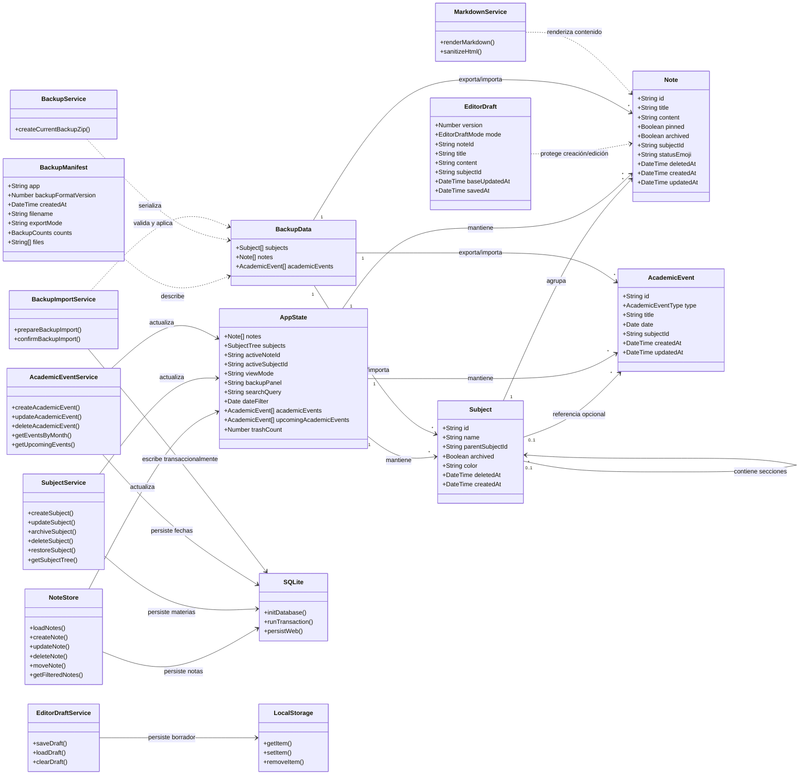

# Modelo de Dominio — Lumapse

**Tipo:** Diagrama UML de Estructura (Clases)  
**Última actualización:** 2026-07-03 (`v0.4.8`)  
**Autor:** José David Sandoval

---

## Objetivo del diagrama

Modelar las entidades principales, servicios de dominio y límites de persistencia que componen Lumapse en el corte `v0.4.8`. Este diagrama describe el modelo conceptual de la app y su relación con la persistencia local SQLite, sin reemplazar el detalle físico documentado en [`database/04-modelo-fisico-ddl.md`](./database/04-modelo-fisico-ddl.md).

> **Nota de evolución:** El modelo original incluía `Tag` y persistencia IndexedDB. Tras el pivote mobile-first se adoptó SQLite ([ADR-006](../adr/ADR-006-arquitectura-de-persistencia-y-tooling-sqlite-para-desarrollo-web-y-native.md)) y organización por Materia/Sección. En Hito 05 se agregan `AcademicEvent`, borradores persistentes del editor y portabilidad por backup ZIP (`RF-017` / `RF-018`).

---

## Diagrama de Clases



---

## Entidades del dominio

### Note (Nota)

Entidad central de captura. Representa una nota local, escrita como texto plano o Markdown.

| Atributo | Tipo | Descripción |
|---|---|---|
| `id` | `String` | Identificador UUID v4 generado en cliente. |
| `title` | `String` | Título calculado/desnormalizado a partir de la primera línea significativa del contenido. |
| `content` | `String` | Contenido de la nota en texto plano/Markdown. |
| `pinned` | `Boolean` | Indica si la nota se fija al inicio del feed. |
| `archived` | `Boolean` | Indica si la nota se oculta del feed principal y aparece en Archivo. |
| `subjectId` | `String \| null` | Materia o sección asociada. `NULL` representa Entrada. |
| `statusEmoji` | `String \| null` | Marcador académico curado (`📖`, `❓`, `🔥`, `✅`). |
| `deletedAt` | `DateTime \| null` | Fecha de eliminación lógica; `NULL` significa nota activa. |
| `createdAt` / `updatedAt` | `DateTime` | Fechas de creación y última modificación. |

### Subject (Materia / Sección)

Entidad de organización jerárquica. Una materia raíz puede contener secciones hijas; la profundidad máxima permitida es de dos niveles ([DP-004](../producto/decisiones-producto.md)).

| Atributo | Tipo | Descripción |
|---|---|---|
| `id` | `String` | Identificador UUID v4. |
| `name` | `String` | Nombre visible de la materia o sección. |
| `parentSubjectId` | `String \| null` | `NULL` para materia raíz; UUID del padre para sección. |
| `archived` | `Boolean` | Indica si la materia queda fuera del árbol principal. |
| `color` | `String \| null` | Color de identificación visual. |
| `deletedAt` | `DateTime \| null` | Fecha de eliminación lógica usada por Papelera. |
| `createdAt` | `DateTime` | Fecha de creación. |

### AcademicEvent (Fecha académica)

Recordatorio visual pasivo asociado al calendario/Heatmap. No es una agenda completa: no maneja horarios, recurrencias, notificaciones ni sincronización.

| Atributo | Tipo | Descripción |
|---|---|---|
| `id` | `String` | Identificador UUID v4. |
| `type` | `AcademicEventType` | `parcial`, `final`, `tp` o `exposicion`. |
| `title` | `String \| null` | Nota breve opcional. |
| `date` | `Date` | Fecha obligatoria en formato `YYYY-MM-DD`. |
| `subjectId` | `String \| null` | Materia/sección asociada opcional. |
| `createdAt` / `updatedAt` | `DateTime` | Fechas de creación y modificación. |

### EditorDraft (Borrador del editor)

Entidad técnica local que protege trabajo en curso. Vive en `localStorage`, no en SQLite, y se elimina al guardar/actualizar con éxito o al descartar explícitamente.

| Atributo | Tipo | Descripción |
|---|---|---|
| `version` | `Number` | Versión del formato de borrador. |
| `mode` | `EditorDraftMode` | `create` o `edit`. |
| `noteId` | `String \| null` | Nota original cuando el borrador corresponde a edición. |
| `title` / `content` | `String` | Texto pendiente. |
| `subjectId` | `String \| null` | Materia/sección seleccionada en el editor. |
| `baseUpdatedAt` | `DateTime \| null` | Marca temporal de la nota original para restaurar contexto de edición. |
| `savedAt` | `DateTime` | Última persistencia local del borrador. |

### BackupData y BackupManifest

Modelo de portabilidad local del workspace. Un backup incluye datos estructurados y notas Markdown legibles, sin sincronización automática ni dependencia de nube.

| Entidad | Descripción |
|---|---|
| `BackupData` | Agrupa materias, notas y fechas académicas que se exportan/importan. |
| `BackupManifest` | Describe formato, fecha, nombre de archivo, política de datos, conteos y archivos incluidos. |

---

## Servicios y límites

| Servicio / límite | Responsabilidad | Persistencia |
|---|---|---|
| `NoteStore` | Estado reactivo y operaciones de aplicación: crear, editar, mover, eliminar, filtrar y seleccionar notas. | Memoria + delegación a SQLite |
| `SubjectService` | Reglas de materias/secciones: unicidad, profundidad máxima, archivo, papelera y restauración. | SQLite |
| `AcademicEventService` | CRUD de fechas académicas, consultas por mes y próximas fechas. | SQLite |
| `BackupService` | Reúne datos actuales y genera el ZIP restaurable/legible. | Lectura SQLite + ZIP |
| `BackupImportService` | Valida ZIP, prepara preview y aplica importación no destructiva/transaccional. | ZIP + SQLite |
| `EditorDraftService` | Guarda, carga y limpia el borrador local del editor. | `localStorage` |
| `MarkdownService` | Renderiza Markdown y sanitiza HTML para lectura segura. | Sin persistencia |
| `SQLite` | Inicializa schema, ejecuta migraciones idempotentes y transacciones. | `@capacitor-community/sqlite` / `sql.js` web |

---

## Relaciones principales

| Relación | Cardinalidad | Descripción |
|---|---|---|
| Subject → Subject | 0..1 a muchos | Una materia puede contener secciones; una sección no puede contener subsecciones. |
| Subject → Note | 1 a muchos | Una materia o sección agrupa notas mediante `notes.subjectId`; `NULL` significa Entrada. |
| Subject → AcademicEvent | 0..1 a muchos | Una fecha académica puede asociarse opcionalmente a una materia o sección. |
| AppState → Note / Subject / AcademicEvent | 1 a muchos | El store mantiene en memoria datos cargados desde SQLite y estados derivados de UI. |
| EditorDraft → Note | Dependencia | Un borrador puede representar una nota nueva o cambios pendientes sobre una nota existente. |
| BackupData → Note / Subject / AcademicEvent | 1 a muchos | El backup ZIP serializa el workspace local relevante para restauración. |

---

## Esquema SQLite resumido

```text
Database: "lumapse-db" (SQLite via @capacitor-community/sqlite)
├── subjects
│   ├── id TEXT PRIMARY KEY
│   ├── name TEXT NOT NULL
│   ├── parentSubjectId TEXT REFERENCES subjects(id) ON DELETE CASCADE
│   ├── archived INTEGER DEFAULT 0
│   ├── color TEXT
│   ├── deletedAt TEXT
│   └── createdAt TEXT NOT NULL
│
├── notes
│   ├── id TEXT PRIMARY KEY
│   ├── title TEXT
│   ├── content TEXT
│   ├── pinned INTEGER DEFAULT 0
│   ├── archived INTEGER DEFAULT 0
│   ├── subjectId TEXT REFERENCES subjects(id) ON DELETE SET NULL
│   ├── statusEmoji TEXT
│   ├── deletedAt TEXT
│   ├── createdAt TEXT NOT NULL
│   └── updatedAt TEXT NOT NULL
│
├── academic_events
│   ├── id TEXT PRIMARY KEY
│   ├── type TEXT NOT NULL CHECK(type IN ...)
│   ├── title TEXT
│   ├── date TEXT NOT NULL
│   ├── subjectId TEXT REFERENCES subjects(id) ON DELETE SET NULL
│   ├── createdAt TEXT NOT NULL
│   └── updatedAt TEXT NOT NULL
│
└── metadata
    ├── key TEXT PRIMARY KEY
    └── value TEXT
```

> El detalle físico completo, reglas de negocio, migraciones idempotentes e índices está en [`database/04-modelo-fisico-ddl.md`](./database/04-modelo-fisico-ddl.md). Los diagramas de base de datos se actualizan en la fase documental específica porque usan DOT/DBML e imágenes exportadas.

---

*Documento de la fase Idear · Análisis y Relevamiento · Lumapse · PP3 · 2026*
