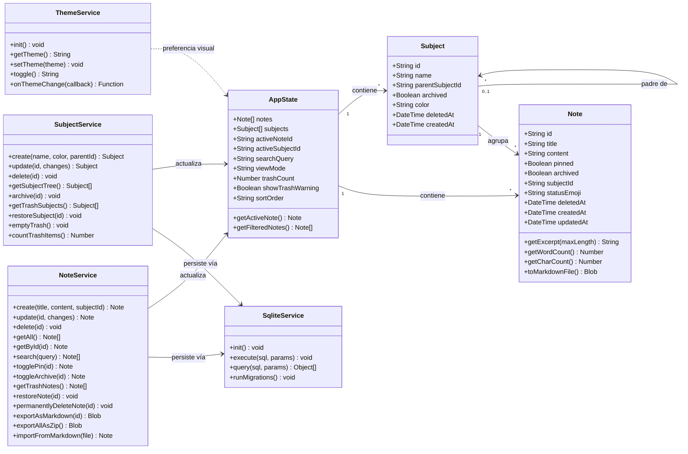

# Modelo de Dominio — Lumapse

**Tipo:** Diagrama UML de Estructura (Clases)  
**Última actualización:** Mayo 2026 (post Papelera, Materias, SQLite)  
**Autor:** José David Sandoval

---

## Objetivo del diagrama

Modelar las **entidades principales** del dominio de Lumapse y sus relaciones. Este diagrama representa la estructura conceptual de los datos que el sistema maneja, independientemente de cómo se implementan internamente. Es el punto de partida para el diseño de la capa de persistencia (SQLite vía `@capacitor-community/sqlite`, [ADR-006](../adr/ADR-006-migracion-sqlite.md)) y del estado de la aplicación (Store).

> **Nota de evolución:** En versiones anteriores (Hito 00), el modelo incluía una entidad `Tag` para clasificar notas con etiquetas. Esta entidad fue descartada a favor de una organización por carpetas/materias ([DP-002](../producto/decisiones-producto.md)). La persistencia migró de IndexedDB ([ADR-002](../adr/ADR-002-persistencia-indexeddb.md)) a SQLite ([ADR-006](../adr/ADR-006-migracion-sqlite.md)) en el Hito 04. El modelo actual refleja el código en producción.

---

## Diagrama de Clases



---

## Descripción de Entidades

### Note (Nota)

Entidad principal del dominio. Representa una unidad de contenido creada por el usuario.

| Atributo | Tipo | Descripción |
|---|---|---|
| `id` | `String` | Identificador único (UUID v4 generado con `crypto.randomUUID()`). |
| `title` | `String` | Título de la nota. Se extrae automáticamente de la primera línea `# ` del contenido Markdown ([DP-001](../producto/decisiones-producto.md)). Campo calculado desnormalizado por rendimiento. |
| `content` | `String` | Contenido de la nota en formato Markdown (texto plano). Sin límite de tamaño. |
| `pinned` | `Boolean` | Indica si la nota está fijada al tope del listado. Default: `false` (INTEGER 0 en SQLite). |
| `archived` | `Boolean` | Indica si la nota está archivada (oculta del feed principal). Default: `false` (INTEGER 0 en SQLite). |
| `subjectId` | `String \| null` | Referencia a la materia o sección a la que pertenece. `NULL` = Entrada (sin materia asignada). FK → `subjects(id)` con `ON DELETE SET NULL`. |
| `statusEmoji` | `String \| null` | Emoji curado de estado académico (`📖`, `❓`, `🔥`, `✅`). `NULL` = sin marcador. ([DP-005](../producto/decisiones-producto.md), [RF-025](../producto/requisitos-funcionales.md)). |
| `deletedAt` | `DateTime \| null` | Fecha y hora de eliminación lógica (ISO 8601). `NULL` = nota activa. Cuando se asigna un timestamp, la nota se mueve a la papelera de reciclaje ([RF-026](../producto/requisitos-funcionales.md)). |
| `createdAt` | `DateTime` | Fecha y hora de creación (ISO 8601). Inmutable. |
| `updatedAt` | `DateTime` | Fecha y hora de última modificación. Se actualiza en cada guardado. |

| Método | Retorno | Descripción |
|---|---|---|
| `getExcerpt(maxLength)` | `String` | Primeros `n` caracteres del contenido, para mostrar en el listado. |
| `getWordCount()` | `Number` | Conteo de palabras del contenido ([RF-006](../producto/requisitos-funcionales.md)). |
| `getCharCount()` | `Number` | Conteo de caracteres del contenido. |
| `toMarkdownFile()` | `Blob` | Genera un archivo `.md` descargable con el contenido de la nota. |

---

### Subject (Materia / Sección)

Entidad de organización que modela carpetas jerárquicas. Una Materia es un `Subject` raíz (`parentSubjectId = NULL`); una Sección es un `Subject` hijo (`parentSubjectId = UUID`). Profundidad máxima: 2 niveles ([DP-004](../producto/decisiones-producto.md)).

| Atributo | Tipo | Descripción |
|---|---|---|
| `id` | `String` | Identificador único (UUID v4). |
| `name` | `String` | Nombre de la materia o sección. Requerido, único por nivel jerárquico. |
| `parentSubjectId` | `String \| null` | `NULL` = Materia raíz. UUID = Sección hija de la materia referenciada. FK auto-referencial → `subjects(id)` con `ON DELETE CASCADE`. |
| `archived` | `Boolean` | Indica si la materia está archivada. Default: `false` (INTEGER 0 en SQLite). |
| `color` | `String \| null` | Color hexadecimal opcional (ej. `#a3e635`). Las secciones hijas heredan el color del padre. |
| `deletedAt` | `DateTime \| null` | Fecha de eliminación lógica. `NULL` = activa. Al eliminar una materia, la cascada marca también sus secciones y notas. |
| `createdAt` | `DateTime` | Fecha y hora de creación (ISO 8601). Inmutable. |

---

### AppState (Estado de la Aplicación)

Objeto centralizado que mantiene el estado en memoria de la aplicación. No se persiste directamente — se reconstruye a partir de los datos en SQLite al iniciar la app. Implementa el patrón Observer para notificar a la UI de los cambios.

| Atributo | Tipo | Descripción |
|---|---|---|
| `notes` | `Note[]` | Todas las notas activas (`deletedAt IS NULL`) cargadas desde SQLite. |
| `subjects` | `Subject[]` | Árbol de materias y secciones activas (`deletedAt IS NULL`, `archived = 0`). |
| `activeNoteId` | `String \| null` | ID de la nota actualmente abierta en el editor. |
| `activeSubjectId` | `String \| null` | ID de la materia o sección seleccionada en el drawer. |
| `searchQuery` | `String` | Texto de búsqueda activo. Vacío = sin filtro. |
| `viewMode` | `String` | Vista activa del feed: `"inbox"` (default), `"subject"`, `"archived"`, `"trash"`, `"all"`. |
| `trashCount` | `Number` | Cantidad total de items en la papelera (notas + materias). |
| `showTrashWarning` | `Boolean` | `true` si `trashCount >= 50`. Dispara un toast de advertencia. |
| `sortOrder` | `String` | Orden del listado: `"updatedAt:desc"` (default), `"title:asc"`. |

| Método | Retorno | Descripción |
|---|---|---|
| `getActiveNote()` | `Note` | Retorna la nota que corresponde a `activeNoteId`. |
| `getFilteredNotes()` | `Note[]` | Retorna las notas filtradas por `viewMode`, `searchQuery`, `activeSubjectId` y `dateFilter`. Las notas fijadas (`pinned`) aparecen siempre al tope. |

---

### NoteService (Servicio de Notas)

Capa de lógica de negocio para operaciones sobre notas. Delega la persistencia al `SqliteService`.

| Método | Retorno | Descripción |
|---|---|---|
| `create(title, content, subjectId)` | `Note` | Crea una nueva nota con `pinned: false`, `archived: false`, `deletedAt: null`, la persiste en SQLite y la agrega al estado. |
| `update(id, changes)` | `Note` | Actualiza una nota existente, persiste los cambios y actualiza `updatedAt`. |
| `delete(id)` | `void` | Eliminación lógica: marca `deletedAt` con la fecha actual. La nota permanece en la BD pero desaparece del feed. |
| `getAll()` | `Note[]` | Recupera todas las notas activas (`deletedAt IS NULL`) desde SQLite. |
| `getById(id)` | `Note` | Recupera una nota específica por ID. |
| `search(query)` | `Note[]` | Búsqueda por texto en título y contenido. |
| `togglePin(id)` | `Note` | Alterna el estado `pinned` de una nota. |
| `toggleArchive(id)` | `Note` | Alterna el estado `archived` de una nota. Si la nota estaba activa en el editor, se deselecciona. |
| `getTrashNotes()` | `Note[]` | Recupera las notas eliminadas lógicamente (`deletedAt IS NOT NULL`), ordenadas por fecha de eliminación. |
| `restoreNote(id)` | `void` | Restaura una nota desde la papelera: `deletedAt = NULL`. |
| `permanentlyDeleteNote(id)` | `void` | Elimina una nota físicamente de la BD (DELETE). |
| `exportAsMarkdown(id)` | `Blob` | Genera un archivo `.md` para descarga. |
| `exportAllAsZip()` | `Blob` | Genera un `.zip` con todas las notas como archivos `.md`. |
| `importFromMarkdown(file)` | `Note` | Crea una nota a partir de un archivo `.md` importado. |

---

### SubjectService (Servicio de Materias)

Capa de lógica de negocio para operaciones sobre materias y secciones. Valida reglas de negocio (nombre único, profundidad máxima 2 niveles) y delega la persistencia al `SqliteService`.

| Método | Retorno | Descripción |
|---|---|---|
| `create(name, color, parentId)` | `Subject` | Crea una nueva materia o sección. Valida nombre requerido, unicidad y profundidad. |
| `update(id, changes)` | `Subject` | Actualiza nombre, color o archivado de una materia. |
| `delete(id)` | `void` | Eliminación lógica con cascada: marca `deletedAt` en la materia, sus secciones hijas y las notas asociadas. |
| `getSubjectTree()` | `Subject[]` | Retorna el árbol jerárquico de materias y secciones activas. |
| `archive(id)` | `void` | Archiva una materia (la oculta del drawer principal). |
| `getTrashSubjects()` | `Subject[]` | Recupera las materias/secciones eliminadas lógicamente. |
| `restoreSubject(id)` | `void` | Restaura una materia y sus secciones/notas asociadas desde la papelera. |
| `emptyTrash()` | `void` | Elimina permanentemente todos los items de la papelera (DELETE físico de notas y materias). |
| `countTrashItems()` | `Number` | Retorna la suma total de notas y materias en la papelera. |

---

### SqliteService (Servicio de Almacenamiento)

Abstracción sobre SQLite vía `@capacitor-community/sqlite` (nativo en Android) y `sql.js`/`jeep-sqlite` (WebAssembly en desarrollo web). Encapsula la conexión, la ejecución de queries y las migraciones de schema.

| Método | Retorno | Descripción |
|---|---|---|
| `init()` | `void` | Inicializa la base de datos, crea las tablas (`subjects`, `notes`, `metadata`) y ejecuta las migraciones idempotentes. |
| `execute(sql, params)` | `void` | Ejecuta una sentencia SQL de escritura (INSERT, UPDATE, DELETE). |
| `query(sql, params)` | `Object[]` | Ejecuta una consulta SQL de lectura (SELECT) y retorna los resultados. |
| `runMigrations()` | `void` | Ejecuta `ALTER TABLE` idempotentes para agregar columnas nuevas (`subjectId`, `statusEmoji`, `deletedAt`, etc.) sin romper instalaciones existentes. |

> Esta capa reemplaza al antiguo `StorageService` basado en IndexedDB (`idb`), que fue desinstalado tras la migración a SQLite ([ADR-006](../adr/ADR-006-migracion-sqlite.md)). La migración one-time de datos legacy de IndexedDB a SQLite se ejecuta automáticamente al primer arranque post-actualización.

---

### ThemeService (Servicio de Tema Visual)

Servicio modular para la gestión del modo oscuro/claro. No persiste datos de dominio — maneja una preferencia de UI.

| Método | Retorno | Descripción |
|---|---|---|
| `init()` | `void` | Carga la preferencia desde `localStorage`. Si no existe, detecta la preferencia del OS (`prefers-color-scheme`). Aplica el atributo `data-theme` al `<html>`. |
| `getTheme()` | `String` | Retorna el tema activo (`"dark"` o `"light"`). |
| `setTheme(theme)` | `void` | Aplica un tema, lo persiste en `localStorage` y actualiza el `meta[name="theme-color"]`. |
| `toggle()` | `String` | Alterna entre oscuro y claro. Retorna el nuevo tema aplicado. |
| `onThemeChange(callback)` | `Function` | Registra un listener que se ejecuta al cambiar de tema. Retorna una función para desuscribirse. |

---

## Relaciones

| Relación | Cardinalidad | Descripción |
|---|---|---|
| AppState → Note | 1 a muchos | El estado contiene todas las notas activas de la app. |
| AppState → Subject | 1 a muchos | El estado contiene el árbol de materias y secciones. |
| Subject → Note | 1 a muchos | Una materia/sección agrupa 0 o más notas (`notes.subjectId`). |
| Subject → Subject | 0..1 a muchos | Auto-referencial: una materia puede contener secciones hijas (`subjects.parentSubjectId`). Máx. 2 niveles. |
| NoteService → SqliteService | Dependencia | NoteService delega la persistencia al SqliteService. |
| SubjectService → SqliteService | Dependencia | SubjectService delega la persistencia al SqliteService. |
| NoteService → AppState | Dependencia | NoteService actualiza el estado en memoria después de cada operación. |
| SubjectService → AppState | Dependencia | SubjectService actualiza el estado en memoria después de cada operación. |
| ThemeService ↔ AppState | Preferencia visual | ThemeService gestiona una preferencia de interfaz independiente del estado de dominio. |

---

## Esquema de SQLite

```
Database: "lumapse" (SQLite vía @capacitor-community/sqlite)
├── Table: subjects
│   ├── PK: id (TEXT, UUID v4)
│   ├── name (TEXT NOT NULL)
│   ├── parentSubjectId (TEXT, FK → subjects.id ON DELETE CASCADE)
│   ├── archived (INTEGER DEFAULT 0)
│   ├── color (TEXT, nullable)
│   ├── deletedAt (TEXT, nullable — ISO 8601 para soft-delete)
│   └── createdAt (TEXT NOT NULL — ISO 8601)
│
├── Table: notes
│   ├── PK: id (TEXT, UUID v4)
│   ├── title (TEXT)
│   ├── content (TEXT)
│   ├── pinned (INTEGER DEFAULT 0)
│   ├── archived (INTEGER DEFAULT 0)
│   ├── subjectId (TEXT, FK → subjects.id ON DELETE SET NULL)
│   ├── statusEmoji (TEXT, nullable)
│   ├── deletedAt (TEXT, nullable — ISO 8601 para soft-delete)
│   ├── createdAt (TEXT NOT NULL — ISO 8601)
│   └── updatedAt (TEXT NOT NULL — ISO 8601)
│
└── Table: metadata
    ├── PK: key (TEXT)
    └── value (TEXT)
```

> **Historial de migraciones:** El schema evolucionó desde IndexedDB v1 (Hito 02) → IndexedDB v2 con `pinned`/`archived` (Hito 04) → SQLite con `subjects`, `subjectId`, `statusEmoji` y `deletedAt` (Hito 04, Paso 8-9). Las migraciones `ALTER TABLE` son idempotentes y se ejecutan en cada arranque.

---

*Documento de la fase Idear · Análisis y Relevamiento · Lumapse · PP3 · 2026*
