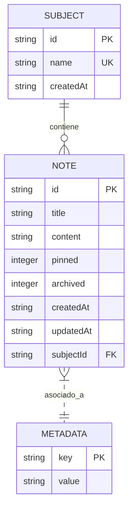

# Modelo Relacional y de Base de Datos — Lumapse

**Tipo:** Documento de Ingeniería de Software (Base de Datos)  
**Nivel:** Académico (PP3 - 3er Año de Tecnicatura en Análisis de Sistemas y Desarrollo de Software)  
**Última actualización:** Mayo 2026  
**Autor:** José David Sandoval  

---

## 1. Importancia Metodológica (Académica)

En el ámbito de la ingeniería de software y para la defensa del proyecto final de **Prácticas Profesionalizantes III (PP3)**, la persistencia de datos debe estar plenamente fundamentada a través de tres niveles de abstracción:

1. **Modelo Conceptual (DER):** Define el plano conceptual y lógico de las entidades del negocio (`Nota`, `Materia`, `Metadata`) y cómo se relacionan entre sí, sin depender de un motor de base de datos específico.
2. **Modelo Lógico (Relacional):** Traduce el modelo conceptual a un esquema tabular estructurado en base a tablas, campos, tipos de datos y reglas de integridad referencial (claves primarias y claves foráneas).
3. **Modelo Físico (SQL):** Consiste en la implementación directa en código SQL (sentencias `CREATE TABLE`), ejecutada en nuestro servicio de persistencia a través del motor SQLite en Capacitor.

A continuación, se documenta la estructura de base de datos de Lumapse bajo estos tres enfoques.

---

## 2. Modelo Conceptual — Diagrama Entidad-Relación (DER)

El siguiente diagrama representa las entidades fundamentales y sus cardinalidades. Una materia (`Subject`) puede contener de **0 a muchas** notas (`Note`), mientras que una nota puede o no pertenecer a una materia (relación opcional, cardinalidad **0 o 1**).



---

## 3. Modelo Lógico (Esquema de Tablas Relacionales)

### Tabla: `notes` (Notas)
Almacena el contenido individual de las notas de estudio y sus metadatos de visualización/archivo.

| Campo | Tipo | Restricción | Descripción |
|---|---|---|---|
| `id` | `TEXT` | `PRIMARY KEY` | Identificador único global de la nota (UUID v4). |
| `title` | `TEXT` | `NULL` | Título derivado de la nota (extraído de la primera línea `# ` de Markdown). |
| `content` | `TEXT` | `NULL` | Contenido completo de la nota en formato Markdown. |
| `pinned` | `INTEGER` | `DEFAULT 0` | Booleano simulado (0 = falso, 1 = verdadero) para fijar al tope. |
| `archived` | `INTEGER` | `DEFAULT 0` | Booleano simulado (0 = falso, 1 = verdadero) para archivar. |
| `createdAt` | `TEXT` | `NOT NULL` | Fecha de creación en formato ISO 8601 UTC. |
| `updatedAt` | `TEXT` | `NOT NULL` | Fecha de última modificación en formato ISO 8601 UTC. |
| `subjectId` | `TEXT` | `FOREIGN KEY` | Enlace a la materia. Referencia a `subjects(id)` (puede ser `NULL` para notas huérfanas en la "Entrada"). |

### Tabla: `subjects` (Materias / Carpetas)
Almacena las materias académicas configuradas por el estudiante para organizar sus notas.

| Campo | Tipo | Restricción | Descripción |
|---|---|---|---|
| `id` | `TEXT` | `PRIMARY KEY` | Identificador único de la materia (UUID v4). |
| `name` | `TEXT` | `UNIQUE NOT NULL` | Nombre descriptivo de la materia (ej. "Álgebra II"). |
| `createdAt` | `TEXT` | `NOT NULL` | Fecha de creación en formato ISO 8601 UTC. |

### Tabla: `metadata` (Metadatos de Sistema)
Tabla técnica de llave-valor utilizada para auditorías internas, control de migraciones y estados globales (offline sync).

| Campo | Tipo | Restricción | Descripción |
|---|---|---|---|
| `key` | `TEXT` | `PRIMARY KEY` | Identificador único de la propiedad técnica. |
| `value` | `TEXT` | `NULL` | Valor asignado a la propiedad técnica. |

---

## 4. Modelo Físico (Código de Creación SQL)

Sentencias DDL ejecutadas en la inicialización de SQLite (`SqliteService.js`). 

> **Nota de Implementación:** Las tablas `notes` (inicial) y `metadata` ya se encuentran operativas en producción tras el Paso 8. La columna `subjectId` y la tabla `subjects` serán enlazadas operativamente en código JS durante el desarrollo del Paso 9 (Categorización por materias).

```sql
-- Creación de la tabla de materias (Carpetas académicas)
CREATE TABLE IF NOT EXISTS subjects (
    id TEXT PRIMARY KEY,
    name TEXT UNIQUE NOT NULL,
    createdAt TEXT NOT NULL
);

-- Creación de la tabla de notas relacionales
CREATE TABLE IF NOT EXISTS notes (
    id TEXT PRIMARY KEY,
    title TEXT,
    content TEXT,
    pinned INTEGER DEFAULT 0,
    archived INTEGER DEFAULT 0,
    createdAt TEXT NOT NULL,
    updatedAt TEXT NOT NULL,
    subjectId TEXT,
    FOREIGN KEY(subjectId) REFERENCES subjects(id) ON DELETE SET NULL
);

-- Creación de la tabla de metadatos del sistema
CREATE TABLE IF NOT EXISTS metadata (
    key TEXT PRIMARY KEY,
    value TEXT
);
```
