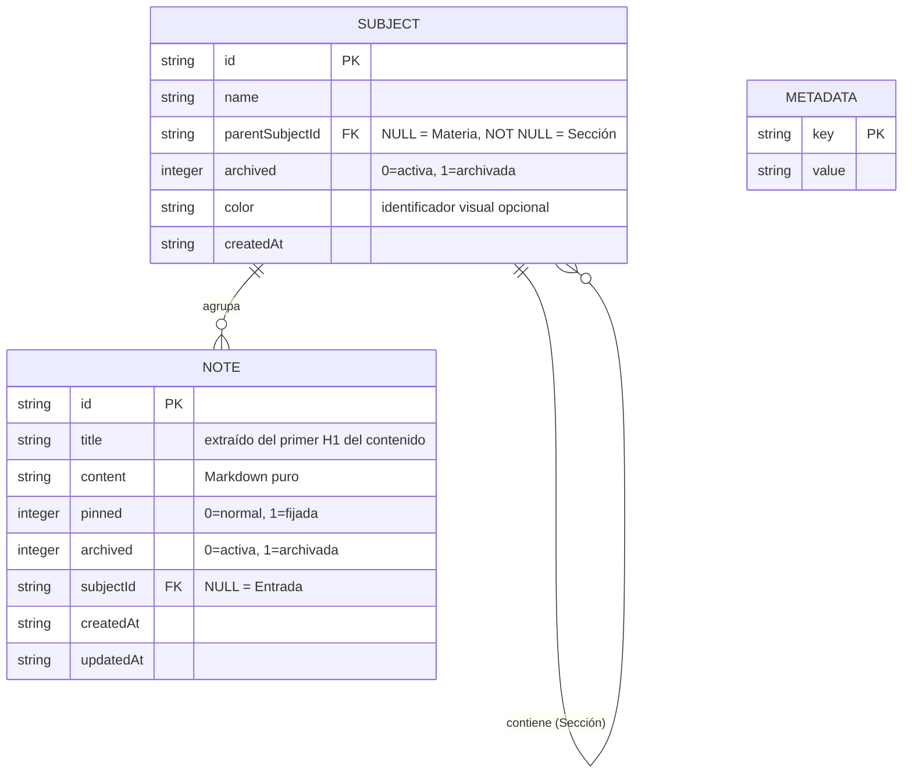

# Modelo Relacional y de Base de Datos — Lumapse

**Tipo:** Documento de Ingeniería de Software (Base de Datos)  
**Nivel:** Académico (PP3 - 3er Año de Tecnicatura en Análisis de Sistemas y Desarrollo de Software)  
**Última actualización:** Mayo 2026  
**Autor:** José David Sandoval  

---

## 1. Importancia Metodológica (Académica)

En el ámbito de la ingeniería de software y para la defensa del proyecto final de **Prácticas Profesionalizantes III (PP3)**, la persistencia de datos debe estar plenamente fundamentada a través de tres niveles de abstracción:

1. **Modelo Conceptual (DER):** Define las entidades del dominio del negocio y cómo se relacionan entre sí, sin depender de un motor de base de datos específico.
2. **Modelo Lógico (Relacional):** Traduce el modelo conceptual a un esquema de tablas con tipos de datos, claves primarias y foráneas, y reglas de integridad referencial.
3. **Modelo Físico (SQL):** La implementación directa en sentencias DDL (`CREATE TABLE`, `ALTER TABLE`) ejecutadas en el motor SQLite vía `@capacitor-community/sqlite`.

---

## 2. Filosofía de Organización — Software Opinionado

Lumapse implementa una estructura de información **opinionada**: no le da al estudiante un lienzo en blanco (como Notion u Obsidian), sino una jerarquía predefinida de **máximo 3 niveles de profundidad** que refleja el flujo de trabajo natural de un estudiante universitario.

```
📥 ENTRADA  (inbox — destino por defecto)
│
📚 MATERIAS
│   └── 📁 Programación Orientada a Objetos  ← Materia (Nivel 1)
│         ├── 📂 Teoría                        ← Sección (Nivel 2)
│         │     └── 📝 Clase 01 - Clases      ← Nota (Nivel 3)
│         ├── 📂 TPs
│         └── 📂 Parciales
│
📦 ARCHIVO  (materias aprobadas/archivadas)
    └── 📁 Fundamentos de Programación (archivada)
```

**Regla de negocio fundamental (DP-004):** Una `Sección` no puede contener sub-secciones. La profundidad máxima es: `Materia → Sección → Nota`. Esta restricción elimina la parálisis de decisión del usuario y mantiene la interfaz móvil limpia y navegable con no más de 3 interacciones.

---

## 3. Modelo Conceptual — Diagrama Entidad-Relación (DER)



### Cardinalidades y reglas de integridad

| Relación | Cardinalidad | Descripción |
|---|---|---|
| `SUBJECT` auto-referencial | 1 Materia → 0..N Secciones | Un `subject` sin padre (`parentSubjectId = NULL`) es una **Materia**. Uno con padre es una **Sección**. Máximo 1 nivel de anidamiento. |
| `SUBJECT` → `NOTE` | 1 Subject → 0..N Notas | Una nota pertenece a una Materia o a una Sección. Si `subjectId = NULL`, la nota vive en **Entrada**. |
| `SUBJECT` archivado | — | Archivar una Materia (`archived = 1`) la mueve visualmente a **Archivo** en la UI, junto con todas sus Secciones y Notas. |

---

## 4. Modelo Lógico (Esquema de Tablas Relacionales)

### Tabla: `subjects` (Materias y Secciones)
Almacena tanto las **Materias** (carpetas raíz) como las **Secciones** (subcarpetas dentro de una Materia). La distinción se hace mediante el campo `parentSubjectId`.

| Campo | Tipo | Restricción | Descripción |
|---|---|---|---|
| `id` | `TEXT` | `PRIMARY KEY` | UUID v4 generado en cliente. |
| `name` | `TEXT` | `NOT NULL` | Nombre descriptivo (ej. "BD1", "TPs"). No requiere ser globalmente único. |
| `parentSubjectId` | `TEXT` | `FK → subjects(id)` / `NULL` | Si es `NULL`: es una **Materia** raíz. Si tiene valor: es una **Sección** hija de esa Materia. |
| `archived` | `INTEGER` | `DEFAULT 0` | `0` = activa (visible en Materias). `1` = archivada (visible en Archivo). |
| `color` | `TEXT` | `NULL` | Color de identificación visual opcional (ej. `"#a3e635"`). |
| `createdAt` | `TEXT` | `NOT NULL` | Fecha ISO 8601 de creación. |

### Tabla: `notes` (Notas)
Almacena el contenido Markdown individual. Una nota puede vivir en **Entrada** (`subjectId = NULL`), en una **Materia** o en una **Sección**.

| Campo | Tipo | Restricción | Descripción |
|---|---|---|---|
| `id` | `TEXT` | `PRIMARY KEY` | UUID v4 generado en cliente. |
| `title` | `TEXT` | `NULL` | Extraído automáticamente de la primera línea `# ` del contenido (DP-001). |
| `content` | `TEXT` | `NULL` | Cuerpo de la nota en formato Markdown. Sin límite de tamaño. |
| `pinned` | `INTEGER` | `DEFAULT 0` | `1` = fijada al tope del feed dentro de su contenedor. |
| `archived` | `INTEGER` | `DEFAULT 0` | `1` = archivada individualmente (independiente del estado de su Materia). |
| `subjectId` | `TEXT` | `FK → subjects(id)` / `NULL` | Apunta a una Materia o Sección. `NULL` = la nota está en **Entrada**. |
| `createdAt` | `TEXT` | `NOT NULL` | Fecha ISO 8601 de creación. Inmutable. |
| `updatedAt` | `TEXT` | `NOT NULL` | Fecha ISO 8601 de última modificación. Se actualiza en cada guardado. |

### Tabla: `metadata` (Metadatos del Sistema)
Tabla técnica de clave-valor para control de migraciones, flags de inicialización y configuraciones de sistema.

| Campo | Tipo | Restricción | Descripción |
|---|---|---|---|
| `key` | `TEXT` | `PRIMARY KEY` | Identificador único de la propiedad (ej. `"indexeddb_migrated"`). |
| `value` | `TEXT` | `NULL` | Valor de la propiedad. |

---

## 5. Modelo Físico — Código DDL (SQL)

### Creación de tablas (nuevas instalaciones)

```sql
-- Materias y Secciones (estructura jerárquica auto-referencial, máx. 2 niveles)
CREATE TABLE IF NOT EXISTS subjects (
    id               TEXT    PRIMARY KEY,
    name             TEXT    NOT NULL,
    parentSubjectId  TEXT    REFERENCES subjects(id) ON DELETE CASCADE,
    archived         INTEGER DEFAULT 0,
    color            TEXT,
    createdAt        TEXT    NOT NULL
);

-- Notas (viven en Entrada, en una Materia, o en una Sección)
CREATE TABLE IF NOT EXISTS notes (
    id         TEXT    PRIMARY KEY,
    title      TEXT,
    content    TEXT,
    pinned     INTEGER DEFAULT 0,
    archived   INTEGER DEFAULT 0,
    subjectId  TEXT    REFERENCES subjects(id) ON DELETE SET NULL,
    createdAt  TEXT    NOT NULL,
    updatedAt  TEXT    NOT NULL
);

-- Metadatos del sistema (control de migraciones y flags)
CREATE TABLE IF NOT EXISTS metadata (
    key   TEXT PRIMARY KEY,
    value TEXT
);
```

### Migraciones (instalaciones existentes — idempotentes)

Las siguientes sentencias `ALTER TABLE` se ejecutan en cada arranque de la app. SQLite ignora silenciosamente el error si la columna ya existe.

```sql
-- Migración v1.1: notas con referencia a materia/sección
ALTER TABLE notes ADD COLUMN subjectId TEXT REFERENCES subjects(id) ON DELETE SET NULL;

-- Migración v1.1: materias con soporte de sub-secciones, archivo y color
ALTER TABLE subjects ADD COLUMN parentSubjectId TEXT REFERENCES subjects(id) ON DELETE CASCADE;
ALTER TABLE subjects ADD COLUMN archived INTEGER DEFAULT 0;
ALTER TABLE subjects ADD COLUMN color TEXT;
```

---

## 6. Reglas de Negocio (para implementación en código)

Las siguientes restricciones **no pueden modelarse en SQL puro** y deben validarse en la capa de lógica de negocio (`SqliteService.js`):

1. **Profundidad máxima de 2 niveles:** Al crear una Sección (`parentSubjectId NOT NULL`), verificar que el padre no sea ya una Sección (es decir, que `parent.parentSubjectId IS NULL`). Si el padre ya tiene padre, rechazar la operación con un error descriptivo.
2. **Archivar en cascada (UI):** Al archivar una Materia, la UI debe mostrar todas sus Secciones y Notas como archivadas en la vista de Archivo, aunque a nivel de base de datos solo se marca `subjects.archived = 1` en la Materia.
3. **Notas en Entrada por defecto:** Toda nota nueva se crea con `subjectId = NULL`. El usuario debe mover explícitamente la nota a una Materia o Sección.

---

*Documento vivo · Lumapse · Práctica Profesionalizante III · IES 6023 · 2026*
