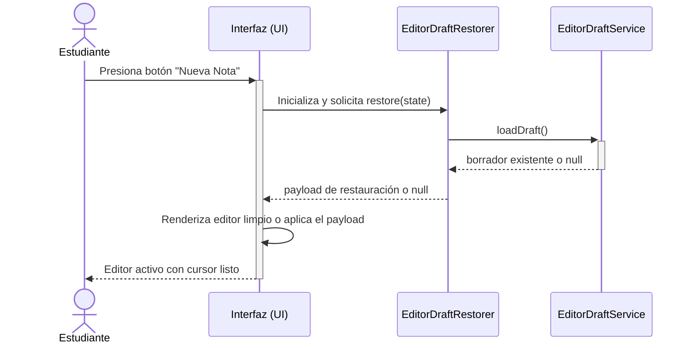
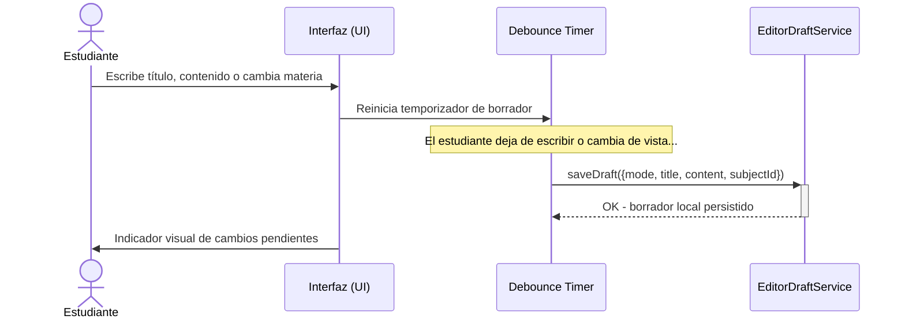
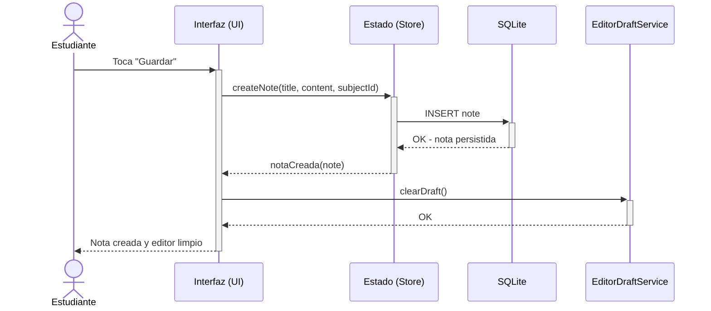
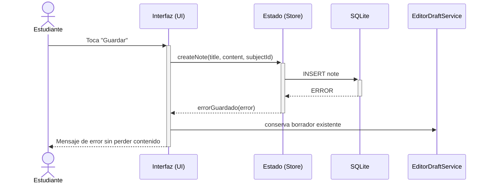

# Diagrama de Secuencia — Crear/Editar Nota con Borrador Persistente

**Tipo:** Diagrama UML de Comportamiento (Secuencia)  
**Última actualización:** 2026-07-15<br>
**Autor:** José David Sandoval

---

## Objetivo del diagrama

Modelar la interacción entre los componentes del sistema durante el flujo principal de **crear o editar una nota protegida por borrador persistente**. Este flujo evita pérdida de texto si el estudiante sale de Lumapse, consulta un PDF, copia contenido o vuelve más tarde, sin crear ni actualizar una nota final hasta que toca `Guardar` o `Actualizar`.

> **Alcance:** Este diagrama se mantiene enfocado en `RF-005` (borradores persistentes). Los flujos de backup/importación ZIP, fechas académicas y Acerca de pertenecen a otros casos de uso del Hito 05 y no forman parte de esta secuencia.

> **Frontera de versión:** El flujo describe el comportamiento de `v0.4.8`; la tabla de participantes enlaza los archivos equivalentes de `main` al 2026-07-15. Si una ruta aparece hoy como `.ts`, ese nombre puede provenir de una migración posterior al tag y no se atribuye a la APK publicada.

---

## Diagrama de Secuencia: Abrir editor de nota nueva



---

## Diagrama de Secuencia: Conservar borrador mientras escribe



---

## Diagrama de Secuencia: Guardar nota final



---

## Diagrama de Secuencia: Volver a Lumapse con borrador pendiente

```mermaid
sequenceDiagram
    actor EST as Estudiante
    participant UI as Interfaz (UI)
    participant RESTORER as EditorDraftRestorer
    participant DRAFT as EditorDraftService
    participant STORE as Estado (Store)

    EST ->> UI: Vuelve desde otra app o abre una vista con editor
    UI ->> RESTORER: Inicializa y solicita restore(state)
    RESTORER ->>+ DRAFT: loadDraft()
    DRAFT -->>- RESTORER: draft

    alt Borrador de nota nueva
        RESTORER -->> UI: payload en modo create
        UI ->> UI: Restaura título, contenido y materia
        UI ->> EST: Botón "Guardar" disponible
    else Borrador de edición
        RESTORER ->> STORE: Lee state.notes y state.notesLoaded
        STORE -->> RESTORER: snapshot del estado observable
        RESTORER ->> RESTORER: state.notes.find(note.id === draft.noteId)
        alt Nota original existe
            RESTORER -->> UI: payload en modo edit
            UI ->> UI: Restaura cambios pendientes
            UI ->> EST: Botón "Actualizar" disponible
        else Las notas todavía no terminaron de cargar
            RESTORER -->> UI: null; espera el próximo estado
        else Nota original ya no existe
            RESTORER -->> UI: payload convertido a modo create
            UI ->> UI: Convierte el contenido pendiente en borrador de nota nueva
            UI ->> EST: Botón "Guardar" disponible
        end
    end
```

---

## Participantes del sistema

| Participante | Responsabilidad | Ubicación en el código |
|---|---|---|
| **Estudiante** | Actor principal. Inicia las acciones de crear, editar, cambiar de app y confirmar guardado. | — |
| **Interfaz (UI)** | Capa de presentación. Maneja eventos del DOM, renderiza el listado, el editor, indicadores y confirmaciones. | `src/components/` |
| **Estado (Store)** | Gestión del estado de la aplicación. Coordina las operaciones CRUD definitivas y expone en memoria `state.notes` y `state.notesLoaded` para la restauración. | `src/store/` |
| **EditorDraftRestorer** | Interpreta el borrador y, cuando corresponde a una edición, localiza la nota original directamente en `state.notes`, sin invocar una consulta del store. | `src/components/note-editor/NoteEditorDrafts.js` |
| **EditorDraftService** | Persistencia local del borrador en curso, con payload versionado y tolerancia a datos corruptos o fallos de storage. | `src/services/EditorDraftService.ts` |
| **Debounce Timer** | Mecanismo de temporización que evita escrituras excesivas del borrador mientras el usuario escribe. | `src/components/note-editor/NoteEditorDrafts.js` |
| **SQLite** | Capa de persistencia local definitiva para notas guardadas. | `src/services/sqlite/` |

---

## Decisiones de diseño reflejadas

| Decisión | Justificación | ADR relacionado |
|---|---|---|
| Borrador persistente local | Protege trabajo en curso ante cierre, pausa o cambio de app sin ensuciar el feed con notas incompletas. | [ADR-005](../adr/ADR-005-pivote-app-nativa.md) |
| Guardado final explícito | Respeta la intención del usuario: la nota definitiva solo se crea o actualiza con `Guardar` o `Actualizar`. | — |
| Limpieza tras éxito | El borrador se elimina solo cuando la persistencia definitiva fue exitosa o cuando el usuario confirma descarte. | — |
| Conversión segura de edición a creación | Si la nota original desaparece, el contenido pendiente se conserva como nota nueva para evitar pérdida de texto. | — |

---

## Escenario alternativo: error al guardar la nota final



> **Nota:** El manejo de errores de persistencia se relaciona con [RNF-010](../producto/requisitos-no-funcionales.md). El borrador persistente actúa como red de seguridad hasta que la nota final se guarde correctamente.

---

*Documento de la fase Idear · Análisis y Relevamiento · Lumapse · PP3 · 2026*
