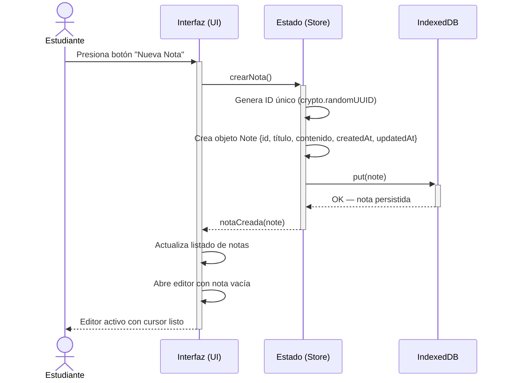
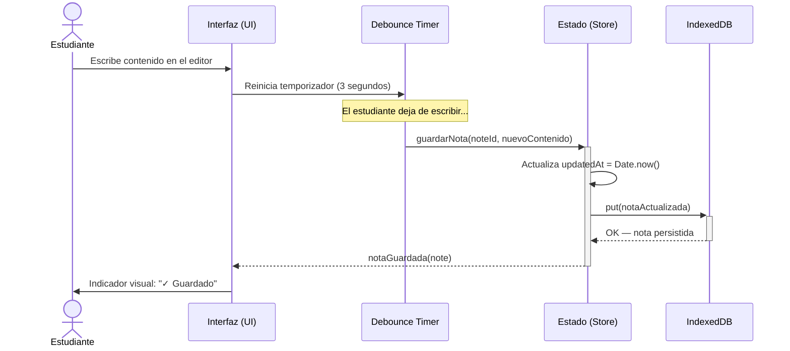
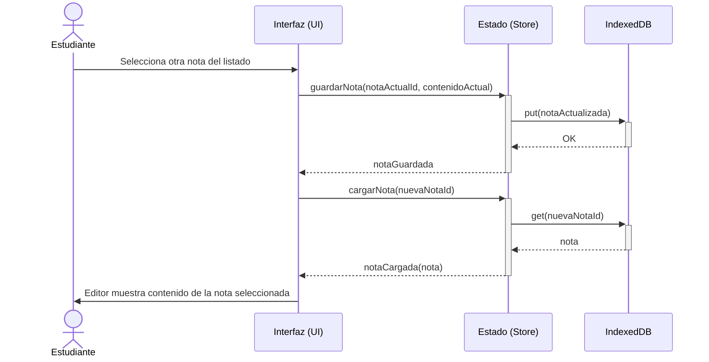
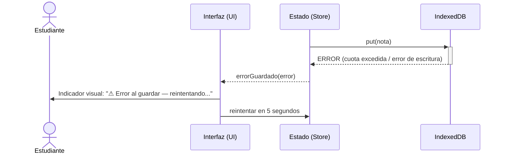

# Diagrama de Secuencia — Crear y Auto-guardar Nota

**Tipo:** Diagrama UML de Comportamiento (Secuencia)  
**Última actualización:** Abril 2026  
**Autor:** José David Sandoval

---

## Objetivo del diagrama

Modelar la interacción entre los componentes del sistema durante el flujo principal de **crear una nueva nota y auto-guardarla**. Este es el caso de uso más frecuente y crítico de Lumapse: el estudiante abre la app, crea una nota, escribe contenido y la app lo persiste automáticamente.

---

## Diagrama de Secuencia: Crear Nota

---

## Diagrama de Secuencia: Auto-guardado

---

## Diagrama de Secuencia: Cambio de nota activa

---

## Participantes del sistema

| Participante | Responsabilidad | Ubicación en el código |
|---|---|---|
| **Estudiante** | Actor principal. Inicia las acciones de crear, editar y navegar entre notas. | — |
| **Interfaz (UI)** | Capa de presentación. Maneja eventos del DOM, renderiza el listado y el editor. | `src/components/` |
| **Estado (Store)** | Gestión del estado de la aplicación. Coordina las operaciones CRUD y mantiene la nota activa en memoria. | `src/store/` |
| **Debounce Timer** | Mecanismo de temporización que evita escrituras excesivas a IndexedDB. Solo persiste después de 3 segundos de inactividad. | `src/services/` |
| **IndexedDB** | Capa de persistencia local del navegador. Almacena las notas como objetos estructurados. | `src/services/` (vía librería `idb`) |

---

## Decisiones de diseño reflejadas

| Decisión | Justificación | ADR relacionado |
|---|---|---|
| Debounce de 3 segundos | Evita escrituras innecesarias a disco; equilibra entre persistencia frecuente y rendimiento. | — |
| `crypto.randomUUID()` para IDs | Genera UUIDs v4 sin dependencias externas, soportado en todos los navegadores modernos. | [ADR-001](../adr/ADR-001-stack-tecnologico.md) |
| IndexedDB como persistencia | Almacenamiento transaccional, asíncrono, con capacidad superior a localStorage. | [ADR-002](../adr/ADR-002-persistencia-indexeddb.md) |
| Guardado al cambiar de nota | Garantiza que nunca se pierde contenido, incluso si el usuario no espera al debounce. | — |

---

## Escenarios alternativos

### Error al persistir en IndexedDB

> **Nota:** El manejo de errores de persistencia es un requisito no funcional ([RNF-010](../producto/requisitos-no-funcionales.md)). La implementación concreta se definirá en el Hito 02.

---

*Documento de la fase Idear · Análisis y Relevamiento · Lumapse · PP3 · 2026*
