# Resultados del Relevamiento de Datos — Lumapse

> **Fecha de análisis:** 2026-05-14  
> **Respuestas válidas:** 120 (de 121 recolectadas)  
> **Nivel de confianza:** 95%  
> **Margen de error:** ~8.5%  
> **Instrumento:** Encuesta Google Forms con ramificación condicional  
> **Período de recolección:** 11/05/2026 – 13/05/2026 (48 hs)

---

## 1. Ficha técnica

| Parámetro | Valor |
|---|---|
| Población objetivo | Estudiantes regulares del IES 6023 "Dr. Alfredo Loutaif" |
| Tamaño de la población (N) | 1.239 |
| Tamaño de la muestra (n) | 120 respuestas válidas |
| Tipo de muestreo | No probabilístico por conveniencia |
| Nivel de confianza | 95% (Z = 1.96) |
| Margen de error estimado | ~8.5% |
| Instrumento | Formulario Google Forms (12 preguntas + 1 condicional) |
| Canales de distribución | WhatsApp (principal), QR en aulas |
| Criterio de exclusión aplicado | 1 registro excluido ("Solo vengo a rendir") |

**Nota sobre la exclusión:** El documento de diseño del relevamiento ([`relevamiento-datos.md`](relevamiento-datos.md) §2) define explícitamente como exclusión a los "Estudiantes que asisten únicamente a rendir examen". Se identificó 1 respuesta con esta condición y fue removida del análisis, quedando 120 respuestas válidas.

---

## 2. Perfil demográfico de la muestra

### 2.1 Distribución por turno (P1)

| Turno | n | % |
|---|---|---|
| Tarde | 56 | 46.7% |
| Noche | 47 | 39.2% |
| Mañana | 17 | 14.2% |

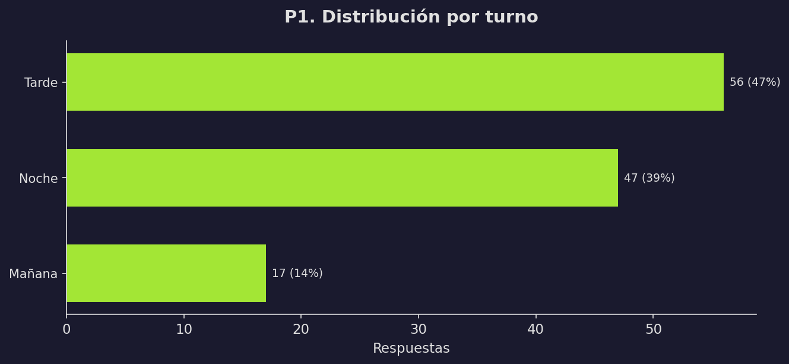

**Observación:** La muestra refleja la distribución real de la matrícula del IES 6023, donde los turnos tarde y noche concentran la mayor parte de los estudiantes. Un registro que indicaba cursar en ambos turnos fue reclasificado al turno tarde (turno principal declarado).

### 2.2 Distribución por carrera (P2)

| Carrera | n | % |
|---|---|---|
| Ed. Primaria | 35 | 29.2% |
| Ed. Especial | 26 | 21.7% |
| Sistemas | 23 | 19.2% |
| Lengua y Lit. | 21 | 17.5% |
| Danzas | 9 | 7.5% |
| Turismo | 6 | 5.0% |

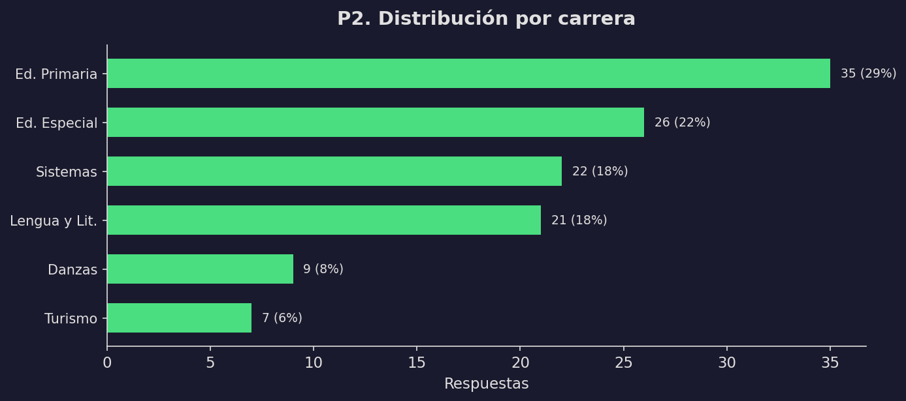

**Observación:** Todas las carreras con matrícula activa están representadas. Las 4 carreras con mayor matrícula (Primaria, Especial, Sistemas, Lengua y Lit.) concentran el 87.5% de la muestra, lo cual es coherente con la proporción de inscriptos por carrera.

### 2.3 Distribución por edad (P3)

| Rango | n | % |
|---|---|---|
| 18-22 | 56 | 46.7% |
| 23-27 | 35 | 29.2% |
| 28-35 | 22 | 18.3% |
| 36-45 | 5 | 4.2% |
| 46 o más | 2 | 1.7% |

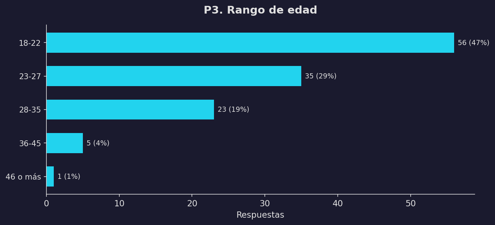

**Observación:** El 75.8% de los encuestados tiene entre 18 y 27 años, lo cual es consistente con el perfil de un instituto de educación superior. Este dato es relevante porque sugiere una población con alta familiaridad con dispositivos móviles y aplicaciones.

---

## 3. Hábitos de toma de notas (P4)

| Método | n | % |
|---|---|---|
| Cuaderno/papel | 106 | 88.3% |
| Celular | 7 | 5.8% |
| No tomo notas | 5 | 4.2% |
| Notebook/PC | 1 | 0.8% |
| Tablet | 1 | 0.8% |

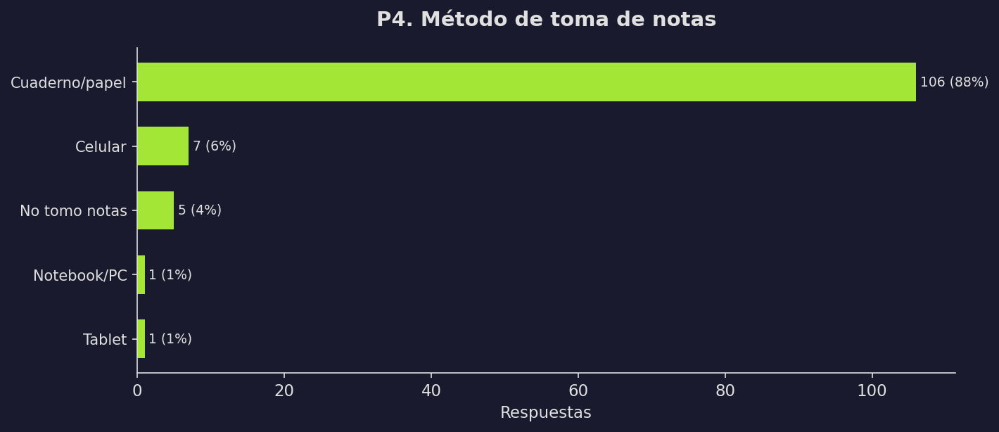

**Hallazgo clave:** El **88.3% de los estudiantes toma notas en cuaderno/papel**. Esto confirma que el público objetivo actual no utiliza herramientas digitales para esta actividad, lo cual representa tanto una oportunidad (mercado sin explotar) como un desafío (hábito arraigado que requiere una propuesta de valor convincente para migrar).

Solo el 7.5% utiliza algún dispositivo digital (celular, notebook o tablet) para tomar notas, lo que indica que Lumapse no competiría contra otras apps, sino contra el cuaderno físico.

---

## 4. Dificultades percibidas (P5, P5b)

### 4.1 ¿Tienen dificultades con la toma de notas?

**Base de cálculo:** 115 estudiantes (se excluyen los 5 que declararon "No tomo notas", ya que P5 solo aplica a quienes toman notas activamente).

| Respuesta | n | % |
|---|---|---|
| No | 59 | 51.3% |
| Sí | 56 | 48.7% |

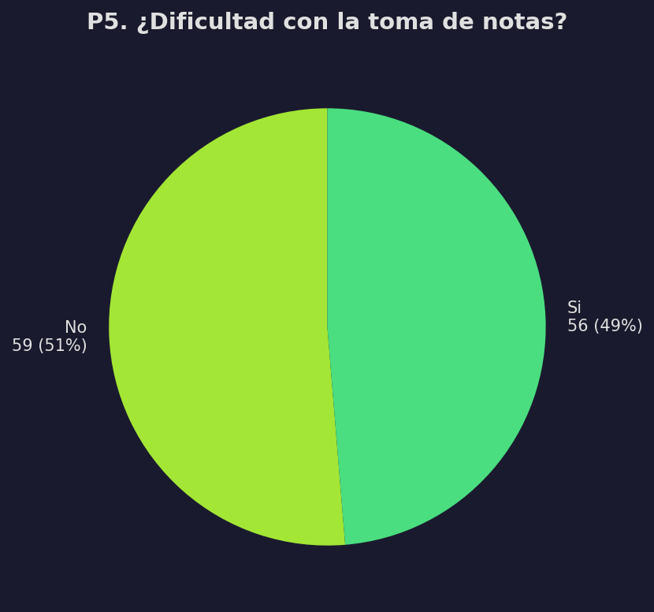

**Hallazgo:** Prácticamente la mitad de los estudiantes que toman notas reconoce dificultades en el proceso. Este dato valida la hipótesis central del proyecto: existe un problema real percibido por los usuarios.

### 4.2 Dificultades concretas (P5b)

**Base de cálculo:** 56 estudiantes que respondieron "Sí" en P5 (multi-respuesta, hasta 3 opciones).

| Dificultad | n | % |
|---|---|---|
| Pierdo notas con frecuencia | 33 | 58.9% |
| Se desorganizan rápido | 33 | 58.9% |
| Me cuesta organizar el formato (títulos, listas, tablas, fórmulas) | 22 | 39.3% |
| No encuentro lo que busco | 13 | 23.2% |
| No puedo acceder desde otro dispositivo | 3 | 5.4% |

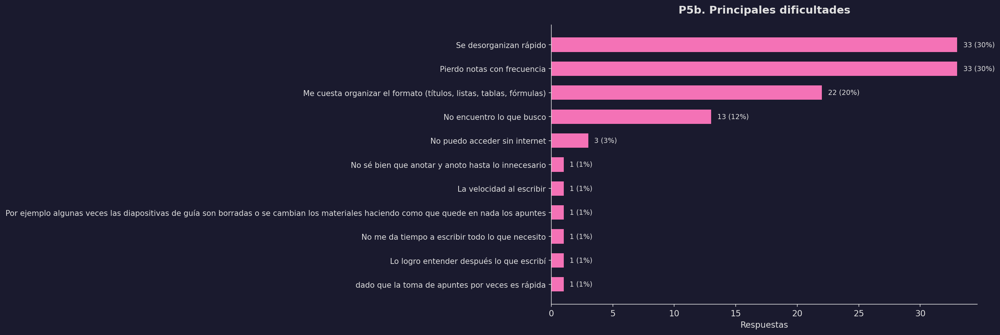

**Hallazgo clave:** Las dos dificultades principales —pérdida de notas y desorganización— están empatadas en el 58.9%. Ambas son problemas que una aplicación digital resuelve directamente (persistencia automática y organización por materia/carpeta). El formato de contenido (39.3%) también es abordable con un editor estructurado.

---

## 5. Conectividad en el instituto (P6)

| Frecuencia de acceso | n | % |
|---|---|---|
| A veces | 42 | 35.0% |
| Raramente | 29 | 24.2% |
| Nunca | 27 | 22.5% |
| Casi siempre | 15 | 12.5% |
| Siempre | 7 | 5.8% |

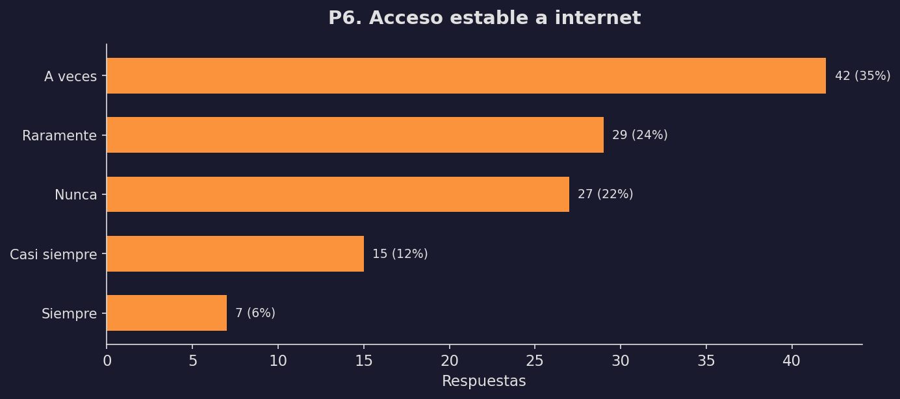

**Hallazgo crítico:** El **81.7% de los encuestados percibe conectividad deficiente** en el instituto (sumando "A veces", "Raramente" y "Nunca"). Solo el 18.3% reporta acceso estable. Este dato es determinante para la arquitectura de la aplicación: **el funcionamiento offline no es un nice-to-have, es un requisito esencial**.

---

## 6. Interés en la propuesta de valor (P7)

**Pregunta:** "¿Qué tan útil te parecería una app que te ayude a organizar tus notas de clase de forma rápida y desde tu celular?" (Escala Likert 1-5)

| Valoración | n | % |
|---|---|---|
| 5 — Muy útil | 61 | 50.8% |
| 4 — Útil | 36 | 30.0% |
| 3 — Algo útil | 17 | 14.2% |
| 2 — Poco útil | 4 | 3.3% |
| 1 — Nada útil | 2 | 1.7% |

| Métrica | Valor |
|---|---|
| Media | 4.25 / 5 |
| Mediana | 5 (Muy útil) |

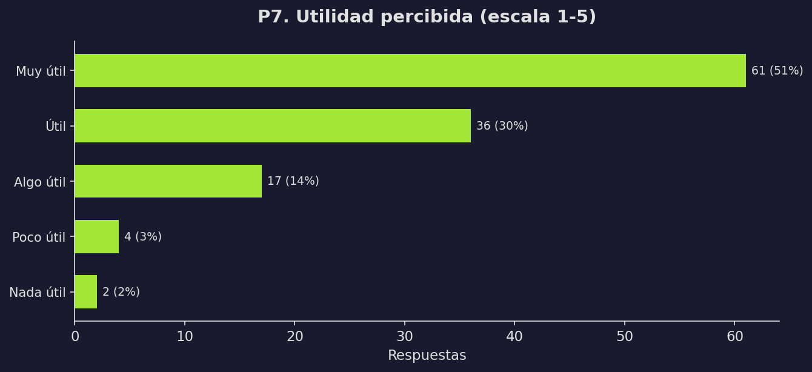

**Hallazgo clave:** El **80.8% califica la propuesta como útil o muy útil** (puntuaciones 4 y 5). La media de 4.25 sobre 5 indica una percepción fuertemente positiva. Solo el 5% la considera poco o nada útil. Este nivel de aceptación valida que existe demanda real para el producto.

---

## 7. Priorización de funcionalidades (P8)

**Multi-respuesta:** Cada encuestado seleccionó hasta 3 características de una lista predefinida (base: 120).

| Característica | n | % |
|---|---|---|
| Que funcione sin internet | 89 | 74.2% |
| Que permita organizar por materia | 88 | 73.3% |
| Que funcione en celular y PC | 64 | 53.3% |
| Que guarde automáticamente | 63 | 52.5% |
| Que sea rápida | 54 | 45.0% |
| Que no pida cuenta | 13 | 10.8% |

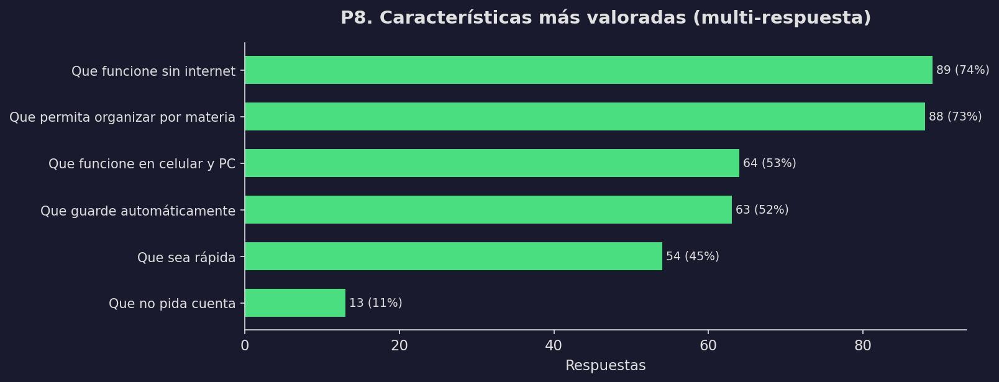

**Hallazgo clave:** Las dos funcionalidades más demandadas —**offline** (74.2%) y **organización por materia** (73.3%)— están prácticamente empatadas y fueron seleccionadas por 3 de cada 4 encuestados. La multiplataforma (53.3%) y el guardado automático (52.5%) completan un segundo bloque de prioridades.

**Implicancia para el MVP:** Estas 4 funcionalidades constituyen el núcleo mínimo que los usuarios esperan. La baja demanda de "que no pida cuenta" (10.8%) sugiere que un sistema de autenticación ligero es aceptable si aporta beneficios (sincronización, backup).

---

## 8. Dispositivo de uso (P9)

| Dispositivo | n | % |
|---|---|---|
| Celular | 87 | 72.5% |
| Cualquiera por igual | 27 | 22.5% |
| Notebook/PC | 5 | 4.2% |
| Tablet | 1 | 0.8% |

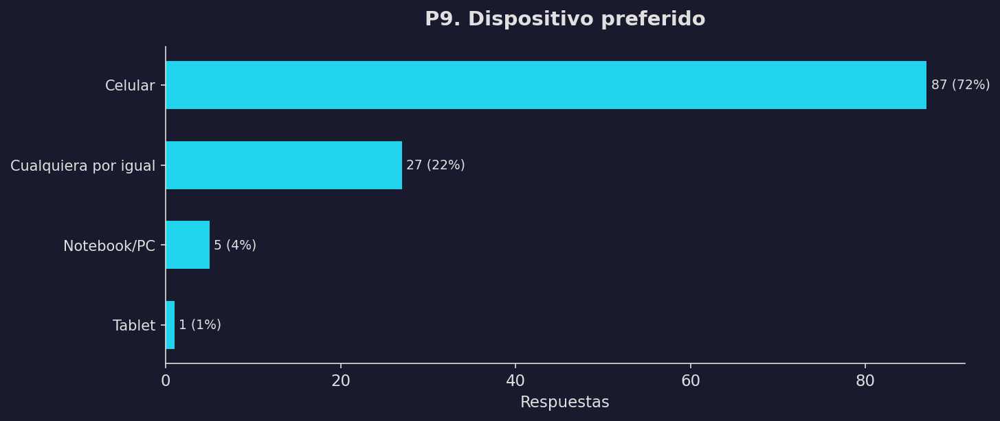

**Hallazgo crítico:** El **72.5% usaría Lumapse desde el celular**. Si sumamos "Cualquiera por igual" (que incluye celular), el 95% de los usuarios potenciales espera poder usar la app desde un dispositivo móvil. Este dato tiene implicancias directas en la decisión de arquitectura (ver §14. Conclusiones).

---

## 9. Disposición a probar el prototipo (P10)

| Respuesta | n | % |
|---|---|---|
| Sí | 97 | 80.8% |
| Tal vez | 22 | 18.3% |
| No | 1 | 0.8% |

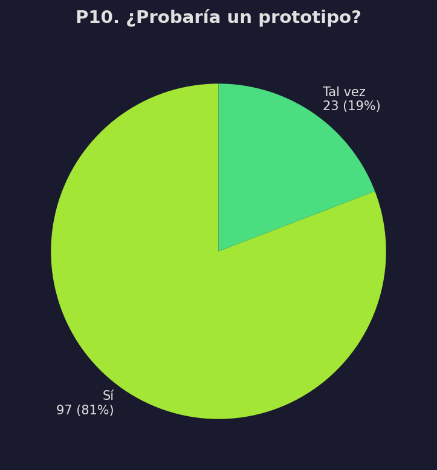

**Hallazgo:** El **99.2% estaría dispuesto a probar un prototipo** (sumando "Sí" y "Tal vez"). Solo 1 persona respondió "No". Este nivel de apertura garantiza que existe masa crítica para un beta testing real cuando el prototipo esté disponible.

---

## 10. Modelo de organización preferido (P11)

| Organización | n | % |
|---|---|---|
| Carpetas por materia | 83 | 69.2% |
| Etiquetas/tags | 24 | 20.0% |
| No me importa cómo se organice | 10 | 8.3% |
| Lista simple | 3 | 2.5% |

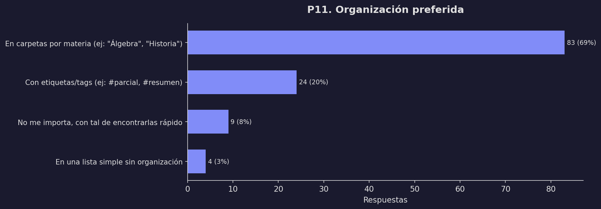

**Hallazgo:** El modelo de **carpetas por materia** es el preferido por el 69.2%. Esto es coherente con P8 donde "organizar por materia" fue la segunda feature más votada. La navegación principal del MVP debe estructurarse en torno a materias/asignaturas como eje organizativo principal.

---

## 11. Análisis cualitativo — Comentarios abiertos (P12)

**Tasa de participación:** 41 de 120 encuestados dejaron comentarios (34.2%). Esta tasa es alta para una pregunta abierta opcional, lo que indica compromiso con el tema.

Los 41 comentarios fueron categorizados temáticamente mediante palabras clave. Cada comentario puede pertenecer a más de una categoría.

### 11.1 Distribución por categoría temática

| Categoría | Menciones | Descripción |
|---|---|---|
| Otros | 10 | Comentarios generales no clasificables |
| Positivos / apoyo | 7 | Expresiones de entusiasmo ("Éxitos", "buena idea") |
| Planificaciones docentes | 7 | Necesidad de plantillas para planificaciones didácticas |
| Organización avanzada | 6 | Mapas mentales, esquemas jerárquicos, cuadros sinópticos |
| Multimedia (fotos, audio) | 5 | Adjuntar fotos de pizarrón, grabar audios de clase |
| Velocidad de captura | 4 | Dificultad para seguir el ritmo del docente |
| Fórmulas / contenido técnico | 4 | Ecuaciones, diagramas, análisis sintáctico en latín |
| Conectividad | 3 | Refuerzan la necesidad offline |
| Recuperación / historial | 3 | Guardar versiones, recuperar notas eliminadas |
| Agenda / calendario | 3 | Fechas de parciales, horarios de materias |

### 11.2 Necesidades emergentes por carrera

Los comentarios revelan necesidades diferenciadas según el perfil académico:

- **Ed. Primaria / Ed. Especial (profesorados):** Plantillas de planificación didáctica, cuadros sinópticos y la posibilidad de adjuntar imágenes. Sus necesidades están orientadas a la **producción docente**, no solo a la captura de notas.
- **Lengua y Literatura:** Esquemas jerárquicos, análisis de sintagma, compatibilidad con grabador de voz. Requieren **estructura textual avanzada**.
- **Sistemas:** Diagramas técnicos, interfaz similar a un gestor de texto profesional, fechas de parciales. Perfil más **orientado a herramientas**.
- **Danzas / Turismo:** Comentarios menos específicos, centrados en la organización general y resúmenes de contenido teórico.

### 11.3 Citas textuales destacadas

> *"Tomar notas desde una app es una buena idea pero tiene que ser sin Internet porque en el instituto no todos tienen acceso."* — Ed. Especial

> *"Que la app permita el diseño de mapas mentales o esquemas jerárquicos de información."* — Lengua y Lit.

> *"Que no solo se escriban notas, sino que también se pueda incluir audios y fotos."* — Ed. Primaria

> *"Para tomar nota se necesita ser muy rápido porque sino se pierde información importante."* — Lengua y Lit.

---

## 12. Cruces estadísticos

Se generaron 6 tablas cruzadas para detectar relaciones entre variables. A continuación se presentan los hallazgos más relevantes.

### 12.1 Carrera × Dispositivo (P2 × P9)

| Carrera | Celular | Cualquiera | Notebook/PC | Tablet |
|---|---|---|---|---|
| Ed. Primaria | 30 | 4 | 1 | 0 |
| Ed. Especial | 17 | 8 | 1 | 0 |
| Sistemas | 16 | 6 | 1 | 0 |
| Lengua y Lit. | 15 | 5 | 1 | 0 |
| Danzas | 6 | 3 | 0 | 0 |
| Turismo | 3 | 1 | 1 | 1 |

**Interpretación:** El celular domina en **todas las carreras** sin excepción. Incluso en Sistemas —donde se podría esperar mayor afinidad con Notebook/PC— el celular es preferido por el 70%. No hay evidencia de que alguna carrera requiera un enfoque desktop-first.

### 12.2 Método actual × Dispositivo deseado (P4 × P9)

| Método actual | Celular | Cualquiera | Notebook/PC | Tablet |
|---|---|---|---|---|
| Cuaderno/papel | 79 | 24 | 3 | 0 |
| Celular | 3 | 3 | 1 | 0 |
| No tomo notas | 5 | 0 | 0 | 0 |

**Hallazgo clave:** De los 106 estudiantes que actualmente usan cuaderno/papel, el **74.5% elegiría el celular** como dispositivo para una app de notas. Esto revela la **brecha entre el hábito actual y la aspiración tecnológica**: los estudiantes no usan digital porque no tienen la herramienta adecuada, no porque rechacen la tecnología.

### 12.3 Edad × Método de notas (P3 × P4)

**Interpretación:** El cuaderno/papel domina en todos los rangos etarios (>85% en cada grupo). No se observa que los más jóvenes (18-22) usen más dispositivos digitales que los mayores. El hábito analógico es transversal a la edad.

### 12.4 Dispositivo × Organización (P9 × P11)

**Interpretación:** Quienes prefieren celular eligen mayoritariamente carpetas por materia (71%). El modelo de organización preferido no varía significativamente según el dispositivo, lo que simplifica el diseño de la interfaz: un único modelo de navegación por carpetas/materias funciona para todos los segmentos.

### 12.5 Edad × Features (P3 × P8)

**Interpretación:** "Funcionar sin internet" y "organizar por materia" lideran en todos los rangos etarios. No se detectan necesidades diferenciadas por edad para las funcionalidades core. La priorización del MVP puede ser universal sin necesidad de segmentar por edad.

### 12.6 Turno × Dificultades (P1 × P5b)

**Interpretación:** Las dificultades reportadas son homogéneas entre turnos. "Pierdo notas" y "Se desorganizan rápido" lideran tanto en turno tarde como noche. No hay evidencia de que un turno específico requiera funcionalidades diferenciadas.

---

## 13. Validación de artefactos de diseño

Los hallazgos del relevamiento se contrastan con los artefactos producidos en fases anteriores del Design Thinking para verificar si los datos **confirman**, **matizan** o **contradicen** las decisiones previas.

### 13.1 Problem Statement

| Supuesto original | Evidencia empírica | Veredicto |
|---|---|---|
| Los estudiantes tienen dificultades para organizar sus notas | 48.7% reconoce dificultades; las dos principales son pérdida y desorganización | ✅ **Confirmado** |
| La desorganización provoca pérdida de información | 58.9% reporta pérdida de notas y desorganización rápida | ✅ **Confirmado** |
| Una herramienta digital mejoraría la situación | 80.8% la considera útil o muy útil (media 4.25/5) | ✅ **Confirmado** |

### 13.2 Personas

| Persona definida | Contraste con datos | Veredicto |
|---|---|---|
| Estudiante joven (18-27) como usuario principal | 75.8% de la muestra tiene 18-27 años | ✅ **Confirmado** |
| Uso predominante de celular | 72.5% prefiere celular; 95% lo incluye | ✅ **Confirmado** |
| Conectividad limitada como contexto | 81.7% reporta conectividad deficiente | ✅ **Confirmado** |
| Necesidad de organización por materia | 73.3% la prioriza como feature; 69.2% prefiere carpetas por materia | ✅ **Confirmado** |

### 13.3 Requisitos funcionales

| Requisito previsto | Demanda detectada | Veredicto |
|---|---|---|
| Funcionamiento offline | 74.2% lo prioriza (feature #1) | ✅ **Confirmado como crítico** |
| Organización por materia | 73.3% lo prioriza (feature #2) | ✅ **Confirmado como crítico** |
| Multiplataforma (celular + PC) | 53.3% lo valora | ✅ **Confirmado** |
| Guardado automático | 52.5% lo valora | ✅ **Confirmado** |
| Editor de contenido rico (fórmulas, esquemas) | Mencionado en P12 por múltiples carreras | ⚠️ **Matizado**: es una necesidad real pero secundaria para el MVP |
| Multimedia (fotos, audio) | Mencionado en P12 por profesorados | ⚠️ **Matizado**: emergente, no contemplado inicialmente |

### 13.4 Lean Canvas

| Hipótesis del Canvas | Evidencia | Veredicto |
|---|---|---|
| Problema: los estudiantes pierden o desorganizan sus notas | Validado cuantitativamente (P5, P5b) | ✅ **Confirmado** |
| Segmento: estudiantes de nivel superior | 120 respuestas de 6 carreras del IES 6023 | ✅ **Confirmado** |
| Propuesta de valor: app rápida y offline para notas | 74.2% offline + 45% rapidez + 80.8% utilidad percibida | ✅ **Confirmado** |
| Canal: distribución directa (sin app store) | Solo 10.8% prioriza "sin cuenta". La distribución por APK o PWA es viable | ✅ **Viable** |

---

## 14. Conclusiones y recomendaciones

### 14.1 Hallazgos principales

1. **El problema existe y es percibido:** El 48.7% de los estudiantes que toman notas reconoce dificultades. Las principales son la pérdida de notas (58.9%) y la desorganización rápida (58.9%).

2. **La demanda es real:** El 80.8% califica la propuesta como útil o muy útil (media 4.25/5). El 99.2% estaría dispuesto a probar un prototipo.

3. **El celular es el dispositivo dominante:** El 72.5% usaría la app desde el celular. Este dato es consistente en todas las carreras y rangos etarios.

4. **El offline es un requisito, no una feature:** El 81.7% percibe conectividad deficiente y el 74.2% prioriza el funcionamiento sin internet como la característica más importante.

5. **La organización por materia es el modelo esperado:** El 73.3% la prioriza como feature y el 69.2% prefiere carpetas por materia como estructura organizativa.

6. **El competidor no es otra app, es el cuaderno:** El 88.3% toma notas en papel. La propuesta de valor debe ser lo suficientemente convincente para migrar un hábito arraigado.

### 14.2 Recomendaciones para el producto

| Prioridad | Recomendación | Evidencia |
|---|---|---|
| 🔴 Crítica | Implementar funcionamiento offline robusto | P6 (81.7% sin internet) + P8 (74.2% feature #1) |
| 🔴 Crítica | Diseñar la interfaz mobile-first | P9 (72.5% celular) + cruce P2×P9 (transversal) |
| 🔴 Crítica | Organizar notas por materia/carpeta | P8 (73.3%) + P11 (69.2%) |
| 🟡 Alta | Guardado automático y persistente | P8 (52.5%) + P5b (58.9% pérdida de notas) |
| 🟡 Alta | Interfaz rápida y minimalista | P8 (45%) + P12 (velocidad de captura) |
| 🟢 Media | Multiplataforma (celular + PC) | P8 (53.3%) |
| 🟢 Media | Evaluar soporte multimedia (fotos, audio) | P12 (5 menciones cualitativas) |
| ⚪ Baja | Sistema de autenticación ligero | P8 ("sin cuenta" solo 10.8%) |

### 14.3 Evaluación de arquitectura: PWA vs. App Nativa

Los datos presentan señales que deben evaluarse para la decisión de arquitectura:

**Señales a favor de priorizar mobile (app nativa o PWA optimizada):**
- El 72.5% usaría la app desde el celular (P9)
- El 81.7% tiene conectividad deficiente (P6), requiriendo offline robusto
- El 88.3% actualmente usa cuaderno; la adopción digital requiere mínima fricción

**Consideraciones técnicas (a evaluar en el ADR correspondiente):**
- Una PWA ofrece multiplataforma con codebase única, pero su persistencia offline (IndexedDB) tiene limitaciones de cuota
- Una app nativa (APK) ofrece mejor persistencia (SQLite), distribución más intuitiva y acceso a hardware (cámara, micrófono)
- La decisión final se documentará en un Architecture Decision Record (ADR) con esta evidencia como input

> **Nota:** Este informe presenta los datos de forma neutral. La decisión de arquitectura es posterior al análisis y se tomará considerando factores adicionales (recursos del equipo, timeline, complejidad técnica).

---

## 15. Limitaciones del estudio

1. **Muestreo no probabilístico:** La encuesta fue distribuida por conveniencia (WhatsApp y QR en aulas), lo que puede introducir sesgo de autoselección. Los resultados son representativos de la muestra, pero no necesariamente generalizables a toda la población.

2. **Margen de error:** Con 120 respuestas de una población de 1.239, el margen de error es de ~8.5% (confianza 95%). Los porcentajes deben interpretarse como tendencias, no como valores exactos.

3. **Sesgo de deseabilidad social:** Las preguntas sobre utilidad percibida (P7) y disposición a probar (P10) pueden tener sesgo positivo, ya que los encuestados podrían responder favorablemente por cortesía o entusiasmo momentáneo.

4. **Período de recolección corto:** 48 horas puede no capturar a todos los segmentos de la población (ej: estudiantes que solo asisten ciertos días).

5. **Pregunta abierta (P12):** La categorización temática fue realizada mediante búsqueda de palabras clave, lo cual puede no capturar matices de lenguaje. Una revisión manual complementaria refinaría los resultados.

6. **Ausencia de datos de uso real:** La encuesta mide percepción e intención declarada, no comportamiento real. La validación definitiva ocurrirá con el prototipo funcional.

---

*Documento generado a partir del análisis automatizado de 120 respuestas válidas. Script de análisis disponible en [`analisis-relevamiento/scripts/`](../../analisis-relevamiento/scripts/). Datos crudos en [`analisis-relevamiento/datos/`](../../analisis-relevamiento/datos/).*
